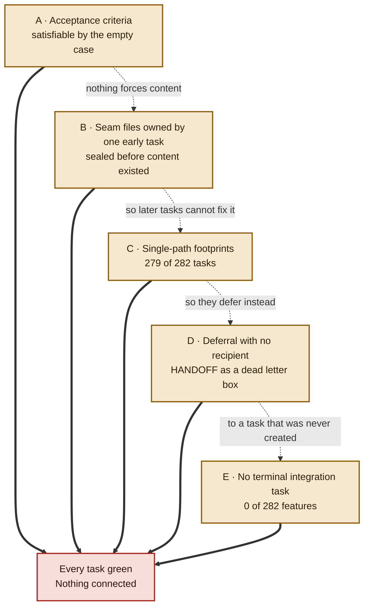
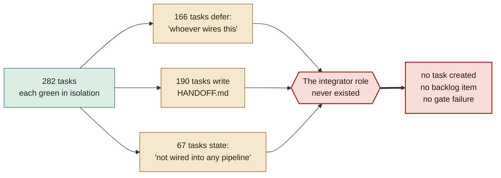
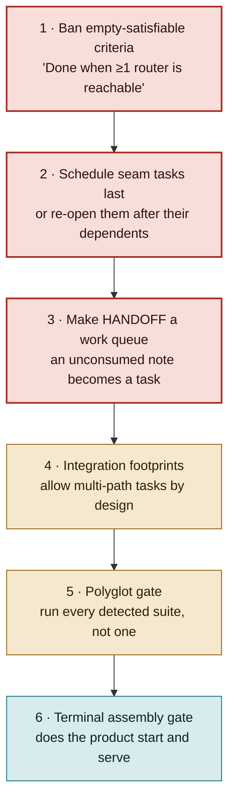

# Process Evaluation — Why claw-forge Left the Seams Empty

**Subject:** the claw-forge run that produced Elicta — 282 tasks, 18 Aug 2026, 06:22 → 23:11
**Companion to:** `code-quality-audit.md`, which establishes *what* is missing. This document establishes *why*.
**Evidence base:** `.claw-forge/state.db` — 282 task records and 80,854 recorded agent events — plus `app_spec.txt`, `claw-forge.yaml`, and the resulting tree.

---

## Verdict

**The process did not fail. It succeeded exactly as specified, and the specification had a hole in it.**

| Run outcome | |
|---|---|
| Tasks completed | **282 / 282** |
| Tasks failed | **0** |
| Bugfix retries | **0** |
| Infra retries | **0** |
| Merge retries | 6, across 6 tasks |

Every task passed its own acceptance criterion. The result is a codebase that does not run. That combination is the finding: **the criteria were satisfiable without integration, so integration never happened.** No agent misbehaved, and no task was executed badly.

The agents, in fact, *knew*. Across the 282 tasks:

| Signal in agent transcripts | Tasks affected |
|---|---|
| Deferred work to "whoever wires this" / "another task" | **166** (59%) |
| Left or referenced a `HANDOFF.md` note | **190** (67%) |
| Explicitly declined an edit as outside the declared footprint | **71** (25%) |
| Explicitly stated their output is not wired into anything | **67** (24%) |

The gap was detected, documented, and reported hundreds of times. It was addressed zero times, because nothing in the system was listening.

---

## The five mechanisms



---

### A · Acceptance criteria satisfiable by the empty case

This is the root cause. The others amplify it.

`app_spec.txt` writes each feature's exit condition as a "Done when" clause. Three of the four scaffolding features are satisfied by a mechanism that works while holding nothing:

| Feature | "Done when…" | Satisfied by |
|---|---|---|
| 1 · workspace skeleton | "the workspace creates a clean build in every zone" | an empty `registry.rs` builds cleanly |
| 2 · service module loader | "the service emits its mounted route list at startup" | emitting a list of **zero** routes |
| 3 · typed API client | "the generator creates typed bindings the desktop shell compiles against" | bindings for **2** endpoints compile fine |

Feature 2 is the clearest case, because the agent then wrote a test that locks the empty state in:

```python
# apps/service/src/app/test_main.py
assert any(
    "feature router(s) mounted" in record.message for record in caplog.records
)
```

With zero routers the app logs `startup: 0 feature router(s) mounted`, the substring matches, and the test passes. A second test is literally named for the empty case — "no feature routers mounted". **The suite is green *because* the app is empty, and would need rewriting for it to be full.** The test encodes the wrong invariant, faithfully derived from a criterion that asked for emission rather than content.

An honest criterion would have been falsifiable by the empty case: *"Done when at least one feature router is reachable over HTTP."*

---

### B · Seam files sealed before there was anything to put in them

`app_spec.txt` does declare the seams — `<seam tier="ordered">core/shared/app/src/registry.rs</seam>` — and assigns each to exactly one owning feature. That ownership is exclusive: no other feature lists those paths in `touches_files`, so no other agent may edit them.

The problem is *when* those owners ran.

```mermaid
gantt
    title Seam tasks ran before the content they were meant to carry
    dateFormat X
    axisFormat %s

    section Service seam
    "module_loader written · task 21 of 282"      :crit, a1, 21, 1
    "the 33 routers it should mount arrive later" :active, a2, 22, 260

    section API contract
    "openapi.json generated · task 22 of 282"     :crit, b1, 22, 1
    "the endpoints it should describe arrive later" :active, b2, 23, 259

    section Rust core seam
    "registry.rs written · task 91 of 282"        :crit, c1, 91, 1
    "the 9 crates it should mount arrive later"   :active, c2, 92, 190
```



Each seam was authored correctly for the world that existed at that moment — and that world was empty. `module_loader.py` was written at task **21 of 282**, when almost no modules existed. `registry.rs` was written at task **91**, and its body is a doc comment ending *"No plugin crates are mounted yet."* That sentence was **true when written** and never revisited.

This also fully explains the stale API client: `packages/api-client` was generated at task **22 of 282**, capturing the 2 endpoints that existed then. The remaining ~31 endpoints arrived across the following 260 tasks, none of which could regenerate it — the contract path belonged to task 22.

**A seam scheduled early is a seam sealed empty.**

---

### C · Single-path footprints make a callee change unable to fix its callers

**279 of 282 features declare a footprint covering exactly one path or glob.** Only three span more than one location. This is the mechanism that keeps parallel agents from colliding, and it works — 6 merge retries across 282 tasks is an excellent conflict rate.

The cost is that no task can change an interface and its consumers in the same commit. The Rust e2e breakage is this failure in miniature:

- The `trigger-gate` lexicon tasks own `core/crates/trigger-gate/src/lexicon/**`. One of them changed `Lexicon::new` to take a leading `lexicon_id`.
- The e2e tasks own `tests/e2e/**` and had already written callers using the two-argument form.
- Neither footprint contains the other. The signature change was correct, the tests were correct when written, and **no task in the system had permission to reconcile them.**

The transcripts show agents hitting this wall constantly and doing the only thing available — writing a note:

> "Left `HANDOFF.md` noting that whoever creates `core/crates/capture/src/lib.rs` needs to add `pub mod enrol;` — that file is outside my declared footprint so I didn't touch it."

---

### D · Deferral to a recipient that does not exist

`HANDOFF.md` is 56KB. **190 tasks wrote to or referenced it. Nothing ever read it.** It is a dead letter box: the process gave agents a way to *record* cross-boundary work but no way to *create* it.



The docstrings inherit the same shape. `module_loader.py` explains that `app/core/*` packages "are mounted explicitly by whoever owns that wiring" — an accurate description of a role no task was ever assigned. Each router takes injected persistence callables so that "whoever wires the app factory supplies the real implementation." The design is sound. The wiring task was never written down, so it was never scheduled.

---

### E · Nothing could have caught it

Two gates existed. Both are blind to this failure class by construction.

**The acceptance gate** runs the project's test suite in the task's worktree. It cannot detect an unwired seam, because unit tests of a correctly-built component pass whether or not anything calls it. Worse, on a polyglot repo it auto-detects *one* command — so a Rust signature change is invisible to a Python gate, which is precisely how the e2e compile break survived. And its documented behaviour is to auto-skip "when no test command is detected (greenfield)" — the early scaffolding tasks that sealed the seams ran under exactly that condition.

**CI** runs six workflows that build, sign, notarise and replay-gate. **None invoke `cargo test`, `pytest`, `vitest`, `ruff` or `clippy`.** The one gate positioned to see the whole assembled system never runs the assembled system.

The net effect: a signed, notarised release binary can be produced from a tree whose test suite does not compile. That is today's state.

---

## What this says about claw-forge as a tool

Read fairly, the run demonstrates real strengths. 282 parallel agent tasks with 6 merge retries and zero infra failures is a strong throughput result, and the footprint mechanism is what bought that. The output is not slop: clippy-clean Rust, 1,643 passing tests, requirement IDs cited throughout, and docstrings that explain design intent honestly — including admitting what they left undone.

The weakness is structural and narrow: **claw-forge optimises for parallel-safe decomposition and has no counterweight pulling the pieces back together.** Every incentive in the system — exclusive footprints, per-task gates, conflict avoidance, worktree isolation — pushes work apart. Nothing pulls it together, so a 282-task run converges on a pile of correct parts.

The tell is that the agents' own judgement was better than the process's. They identified the missing integration 137 times and had no channel to act on it.

---

## Recommendations

Ordered by leverage. The first three are cheap and would have prevented most of this run's outcome.



1. **Reject acceptance criteria that the empty case satisfies.** This is a spec-authoring lint, and it is mechanical: any "Done when" clause whose verb is *emits*, *compiles*, *builds*, *scaffolds* or *creates* should be challenged for a quantity. "Emits its route list" becomes "mounts at least one router and serves it over HTTP". One rule, and features 1, 2 and 3 all fail loudly instead of passing quietly.
2. **Schedule seam tasks last, or re-open them.** A seam authored before its dependents can only be written empty. Either order seam tasks after everything they mount, or mark them re-entrant so they run again once their dependents land. Applies equally to generated contracts — regenerate `api-client` at the end, not at task 22.
3. **Turn `HANDOFF.md` into a queue with a consumer.** 190 tasks reported cross-boundary work into a file nothing reads. If an unconsumed handoff automatically became a task — or blocked the run from reporting success — this run would have surfaced its own gap.
4. **Give integration tasks multi-path footprints.** The footprint model is right for feature work and wrong for wiring. Integration tasks need to span the seam and both sides of it, accepting that they must be serialised against their neighbours.
5. **Run every detected suite on a polyglot repo.** One auto-detected test command leaves per-language blind spots; a Rust API break passing a Python gate is not an edge case in a three-language monorepo.
6. **Add a terminal assembly gate.** The final question is not "did every task pass" but "does the product start, serve a request, and persist a row". A run that finishes 282/282 with a product that cannot boot should not report success.

---

## Appendix — how each number was obtained

| Claim | Source |
|---|---|
| 282/282 completed, 0 failures, retry counts | `SELECT status, bugfix_retry_count, … FROM tasks` |
| 166 tasks deferring to "whoever wires" | regex over 80,854 rows in `events`, distinct `task_id` |
| 190 tasks touching HANDOFF | `SELECT DISTINCT task_id FROM events WHERE payload LIKE '%HANDOFF%'` |
| 71 tasks citing footprint limits · 67 stating "not wired" | same method, separate patterns |
| Seam tasks at positions 21, 22, 91 of 282 | `ORDER BY completed_at`, matched against `touches_files` |
| 279 of 282 single-path footprints | `touches_files` entries containing no comma |
| 74 core / 208 plugin features | `shape=` attribute counts in `app_spec.txt` |
| Criteria satisfiable by the empty case | `app_spec.txt` features 1–3, cross-checked against the shipped tree |
| CI runs no tests | keyword scan of all six workflow files |

Run window 2026-08-18 06:22:15 → 23:11:57 · 282 tasks · 80,854 recorded agent events.
