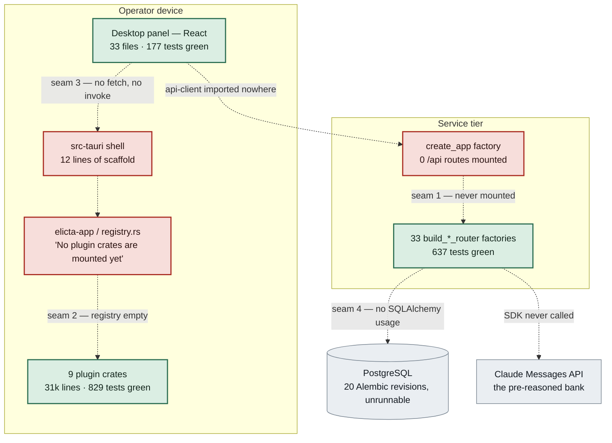
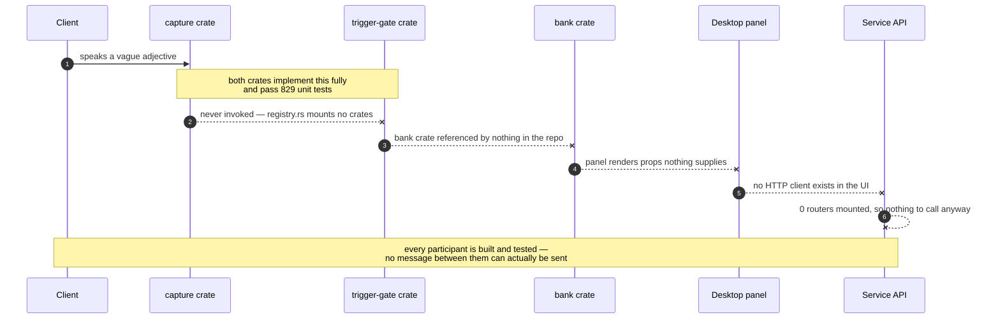
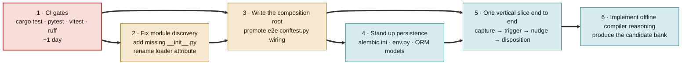

# Code Quality Audit — Elicta

**Audited commit:** `aeae1c7` on `main` (working tree clean)
**Date:** 19 August 2026
**Method:** every finding verified by execution — builds, test runs, linters, and instantiating the app factory — not by reading alone.
**Scope:** the claw-forge-generated codebase, evaluated against `live-elicitation-assistant-prd.md` and `live-elicitation-assistant-architecture.md`.

---

> **Status — remediated 19 Aug 2026.** The integration gaps below have been closed; the
> findings are kept as the record of what was wrong and why. Current state: all four seams
> wired, `cargo test --workspace` green (834), service suite green (642), API integration green
> (45), desktop green (182), 40 API paths served by a running process, migrations runnable, and
> `test.yml` now gates every language. Finding 04 (offline compiler reasoning) is **open** — it
> is product work, not wiring. **Finding 04 is now closed too** — see "Inference engines" at the end.

## Verdict

273 commits produced almost every unit the PRD asks for, to a genuinely high standard — and wired essentially none of them together. The parts are real. The product does not run.

| Measure | Value | |
|---|---|---|
| Unit tests passing (Rust 829 · Python 637 · vitest 177) | **1,643** | ✅ |
| PRD requirement IDs cited in source | **114 / 117** (97%) | ✅ |
| Clippy warnings on lib targets · TypeScript typecheck | **0** · clean | ✅ |
| API routers reachable from the real app factory | **0 / 33** | ❌ |
| Rust plugin crates mounted in the core | **0 / 9** | ❌ |
| CI workflows that run a test suite or linter | **0 / 6** | ❌ |

Component-level completion is high. Integration-level completion is near zero.

---

## 1. The seams

The architecture defines four integration seams. Each was designed carefully and documented in a docstring. All four are empty.



**Solid green = built and tested. Red = the seam that should connect them. Dashed = connection absent.**

| Seam | State | Evidence |
|---|---|---|
| Service → HTTP API | not wired | 33 router factories across 20 files; `create_app()` yields 0 `/api` routes |
| Rust core → plugin crates | not wired | `elicta-app` declares no dependencies; `bank`, `ranking`, `slow-lane`, `wer` referenced by nothing |
| Desktop UI → service | not wired | zero `fetch` / `invoke` / `api-client` imports; `openapi.json` has 2 of ~33 paths |
| Service → database | not wired | no `alembic.ini`, no `env.py`; `sqlalchemy` and `asyncpg` imported nowhere |

### The pattern behind all four

claw-forge built each feature against a clean dependency-injection boundary — which is exactly why the units test so well in isolation — and then no task owned the *other* side of any boundary. Per-feature footprints never included the shared wiring file, so the seams were the one thing nobody was assigned.

---

## 2. What happens at runtime today

The PRD's core loop is capture → trigger → nudge → disposition. Here is where it stops.



---

## 3. Requirements traceability

Requirement IDs are cited in docstrings throughout, which makes coverage measurable rather than a matter of opinion. Counts below are citations in tracked source, excluding the specs themselves.

| Requirement group | Cited | Runtime state |
|---|---|---|
| FR-1 · Consent & capture posture | 7 / 7 | logic only, unmounted |
| FR-2 · Capture & ASR | 26 / 26 | Rust logic, no runtime |
| FR-3 · Engagement & prep | 13 / 14 | routers unmounted |
| FR-4 · Context compiler | 8 / 9 | unmounted, no model calls |
| FR-5 · Trigger gate | 11 / 11 | Rust logic, not mounted |
| FR-6 · Nudge presentation | 10 / 10 | UI only, no data source |
| FR-7 · Debrief & artifacts | 3 / 4 | thinnest area |
| FR-8 · Multi-meeting arc | 10 / 10 | blocked on persistence |
| NFR-2 · Data protection | 7 / 7 | egress chokepoint built |
| NFR-3 · Packaging & signing | 8 / 8 | shipped in CI |
| NFR-4 · Accessibility | 3 / 3 | asserted in UI tests |
| NFR-5 · Ops & telemetry | 8 / 8 | logic only |

**Never cited anywhere:** `FR-3.11` (inherit standing open questions), `FR-4.5` (reviewable question tree), `FR-7.3` (conversational interface over meeting content). Adjacent code exists for each, so these are traceability gaps rather than certain absences — but `FR-4.5` deserves attention: the PRD calls it the phase 0 deliverable, independently valuable even if the live layer never ships, and it currently appears only inside a *failing* end-to-end test.

---

## 4. Findings, ranked by what blocks a running product

### 01 — The service exposes no API · **critical**

Beyond the unmounted routers, two feature modules are invisible to the loader entirely: `engagement` and `replay` have no `__init__.py`, so `pkgutil` never reports them as packages.

A third trap is live. A package that does `from app.modules.nudges.router import …` binds the **submodule** to the name `router`, so the loader's `isinstance(…, APIRouter)` check silently rejects it. The registration convention collides with the file-naming convention.

```text
modules discovered: ['asr-record','compiler','debrief','live-session','nudges','slow-lane']
nudges.router = <module 'app.modules.nudges.router'>  → not an APIRouter → skipped
feature API routes mounted by create_app(): 0
```

### 02 — No persistence tier exists · **critical**

The schema is fully designed in migrations and completely absent from running code. Nothing can outlive a process, so the multi-meeting arc (FR-8) cannot be exercised end to end however well its logic is tested.

```text
grep -r "create_async_engine|sessionmaker|DeclarativeBase" apps/service/src → 0 hits
sqlalchemy, asyncpg: declared in pyproject.toml, imported nowhere
migrations/: 20 revisions, no alembic.ini, no env.py, alembic not a dependency
```

### 03 — CI runs no tests and no linters · **critical**

Six workflows build, sign and release artifacts, and two run replay gates against golden corpora. None invoke `cargo test`, `pytest`, `vitest`, `ruff` or `clippy`. The project can ship a signed, notarised binary built from code whose test suite does not compile — which is the current state.

### 04 — The product's core thesis is unimplemented · **critical**

The architecture's central claim is that expensive analyst reasoning happens offline and the meeting only does selection. The offline half does not exist: `claude-agent-sdk` is a declared dependency appearing in source exactly once, as a string literal in a test assertion. There is no Anthropic client, no Messages API call, and no HTTP transport in the `slow-lane` crate. The pre-reasoned bank the whole design depends on is never produced.

### 05 — Rust end-to-end tests do not compile · **high**

`Lexicon::new` gained a leading `lexicon_id` parameter; all three e2e binaries still call the old two-argument form. A bare `cargo test --workspace` fails outright, hiding 829 healthy unit tests behind a broken sibling target.

```text
tests/e2e/tests/live_journey_vague_adjective_nudge.rs:44
  Lexicon::new("en", ["fast", "scalable", …])
  → expected (lexicon_id, language, terms) — argument #3 is missing
```

Workaround until fixed: `cargo test --workspace --exclude e2e-tests`.

### 06 — Python style gate has never been enforced · **medium**

`ruff check` reports 140 errors (122 auto-fixable) and 95 of 243 files are unformatted. Two errors are structural rather than cosmetic: `N999` on the hyphenated module names `live-session` and `slow-lane`, which are reachable only via `importlib` and will keep tripping any linter assuming importable package names.

### 07 — Generated API client is stale by an order of magnitude · **medium**

`packages/api-client/openapi.json` describes 2 paths against roughly 33 defined endpoints, and no consumer imports the package. It will regenerate to something nearly empty until the app factory mounts routers — this is downstream of finding 01.

### 08 — Build pipeline references a package that does not exist · **low**

`build.yml` runs `pnpm --filter desktop build`, but the workspace package is named `elicta-desktop`; the filter matches no project. The desktop app also has no `test` script, leaving 177 passing tests invisible to humans and automation alike.

---

## 5. What is genuinely well built

An audit that only lists gaps would misrepresent this codebase. None of the findings above are caused by sloppy code.

- **Clippy-clean Rust** — 31k lines across 15 crates, zero warnings on lib targets, 829 passing unit tests.
- **Disciplined traceability** — requirement IDs cited in docstrings throughout, which is what made this audit measurable at all.
- **Docstrings that explain intent, not mechanics** — `module_loader`, `registry.rs` and the e2e `conftest` each explain *why* the seam is shaped as it is, including honest admissions that the wiring does not exist yet.
- **Real design thinking in the seams** — append-only ordered seams and glob-mounted crates were chosen specifically so parallel agents produce independent hunks. The mechanism works; it was never populated.
- **Packaging ahead of the product** — universal macOS binaries, Windows x64/arm64, Authenticode and notarisation, plus cross-platform replay-parity and precision gates. NFR-3 is more complete than most of the functional surface.

---

## 6. Remediation sequence

Ordering matters more than the list: three of these unblock the others, and one prevents the whole class of problem from recurring.



1. **Make CI run the suites first.** Until `cargo test`, `pytest`, `vitest` and `ruff` gate merges, every fix below can silently regress. A day of work that protects everything after it.
2. **Add the missing `__init__.py` files** for `engagement` and `replay`, and rename the loader's expected attribute so it stops colliding with `router.py`. Cheap — two whole modules become visible.
3. **Write the composition root.** `tests/e2e/api_integration/conftest.py` already assembles every router with in-memory stand-ins; it is effectively a working blueprint for the app factory nobody wrote. Promote it and the API surface appears at once.
4. **Stand up persistence** — `alembic.ini`, `env.py`, the alembic dependency, and SQLAlchemy models matching the 20 existing revisions — then swap in-memory stand-ins for real repositories.
5. **Build one vertical slice end to end** before adding features. It surfaces every remaining interface mismatch at once, and is the only way to know the latency budget is met.
6. **Implement the compiler's offline reasoning.** Without it there is no bank to select from, and the architecture's central performance claim stays untested.

---

## Appendix — how each number was obtained

| Claim | Command |
|---|---|
| 829 Rust tests green | `cargo test --workspace --exclude e2e-tests` |
| Rust e2e does not compile | `cargo test -p e2e-tests` |
| 637 Python tests | `cd apps/service && uv run pytest` |
| Python e2e: 44 pass, 1 fail | `uv run --project apps/service python -m pytest tests/e2e/api_integration` |
| 177 vitest tests | `pnpm --filter elicta-desktop exec vitest run` |
| 0 routes mounted | `python -c "from app.main import create_app; print(len(create_app().routes))"` |
| 6 modules discovered, not 8 | `python -c "from app.module_loader import _discover_module_names; print(_discover_module_names())"` |
| 140 ruff errors, 95 unformatted | `uv run ruff check .` · `uv run ruff format --check .` |
| 0 clippy warnings | `cargo clippy --workspace --exclude e2e-tests --lib` |
| TypeScript clean | `pnpm exec tsc --noEmit` |
| 114 / 117 requirements cited | requirement IDs extracted from the PRD, matched against `git ls-files` source |

Measured footprint: 62,471 lines across 535 tracked source files · 273 commits · Rust 1.96.1, Python 3.12, Node 20.

---

## Remediation — what changed

| # | Finding | Status | What closed it |
|---|---|---|---|
| 01 | Service exposes no API | **closed** | `app/composition.py` promoted from the e2e conftest; all 33 router builders mounted; missing `__init__.py` added for `engagement` and `replay`; 0 → 40 API paths |
| 02 | No persistence tier | **partly closed** | `alembic.ini`, `migrations/env.py`, the `alembic` dependency and `DATABASE_URL` added; all 20 revisions now execute and render the full schema, covered by `test_migrations.py`. **Still open:** SQLAlchemy models and SQL-backed repositories — `Backend` is in-memory |
| 03 | CI runs no tests or linters | **closed** | `.github/workflows/test.yml` gates Rust, Python and desktop; `pnpm --filter desktop` corrected to `elicta-desktop` |
| 04 | Core thesis unimplemented | **open** | Product work: needs the Claude Agent SDK wired, prompts designed, and a candidate bank produced. Not a wiring gap |
| 05 | Rust e2e does not compile | **closed** | `Lexicon::new` call sites updated to `(lexicon_id, language, terms)`; the missing FR-2.9 keyterm handshake added to the live-journey driver |
| 06 | Lint gate never enforced | **closed** | 239 violations auto-fixed; ruff config pinned in `pyproject.toml` so the rule set stops drifting with the ruff version. Formatting deferred to its own commit |
| 07 | Generated API client stale | **closed** | Regenerated from the live schema: 2 → 40 paths; desktop now depends on it and calls it through `src/services/` |
| 08 | Build references a missing package | **closed** | Filter corrected; `test`, `test:watch` and `typecheck` scripts added to the desktop package |

Two seams the audit measured are also closed on the Rust side: `registry.rs` mounts all nine
plugin crates with a compile-time test proving each is reachable, and the desktop now has a
typed service layer where it previously had no network code at all.

**Deliberately not done:** `cargo fmt --all` (326 hunks / 64 files) and `ruff format` (95 files).
Both are mechanical and semantics-preserving, but landing them alongside the wiring would bury
it. `test.yml` records where to re-enable each check once they land.

---

## Recursive conformance pass — implementation vs. PRD and architecture

A second pass checked the implementation against the *content* of the docs, not just
requirement-ID citations. Traceability held up well: the §15 reconciliation corrections are
honoured in code (nudge-language cites FR-2.24–2.26 after the P1 renumber, retention cites
FR-2.19 after P2), ADR-004's two independent record-path engines are wired, and ADR-009's
citation guarantees are `nullable=False` in the schema rather than prompt-level.

The pass found a different failure shape: **routers were wired, but the pipeline stages behind
them were not.** 48 service modules end their docstring with "whoever wires the app factory
supplies the real implementation and calls this". Every *router* among them is now mounted — but
that phrase also appears on process functions that no router calls, and those had no caller
anywhere in the application.

| Requirement | What was wrong | Closed by |
|---|---|---|
| **NFR-2.4** (P0) — raw audio discarded once the record path completes | `retention.py` implemented and unit-tested the destruction; nothing invoked it, so raw audio was retained forever | An audio-lifecycle gate in the composition root. Both stages that hold the audio (record-path transcription, diarization) report in; whichever finishes last triggers the discard. 8 tests, including failed-stage and diarization-last ordering |
| **FR-2.14** — ASR detection confined to an engagement-scoped language set | Never derived, so detection was unconstrained. FR-2.11 forbids closing that by asking the operator | Derived at engagement creation, the trigger the module's own docstring names |
| **FR-3.3** — reference content indexed, "compile, don't dump" | Never indexed, so no context pack existed | Indexed on document upload, with chunk store and digest kept in separate sinks so the pack cannot be rebuilt from raw text |
| **FR-4.7** — rank by whether someone in *this* room can answer | Authority scores never recomputed when the roster changed | Rescored when an attendee is added |
| **FR-4.5/4.8** — reviewable question tree (the PRD's phase 0 deliverable) | Implemented in `compiler/api/tree.py` but unreachable: its router was unmounted | Now served at `GET /api/engagements/{id}/bank`, grouped by template section |

**Still uncalled: 11 functions, and 8 of them are one dependency chain** — transcript cleaning →
translation → BMAD analyst chain → citations → coverage matrix, plus the compiler's batch
submission and collection. Every one needs a model pass, so they are blocked on finding 04
rather than on wiring. `run_diarization` needs an external engine and a job trigger; a task queue
does not exist in this codebase yet.

**The lesson generalises past this repo.** "Whoever wires the app factory" appears 48 times.
Every occurrence is an unowned integration point, and grepping that phrase is a faster gap-finder
than reading the code — worth a lint rule in any codebase built by parallel agents.

---

## Pipeline orchestration — the last uncalled functions

The recursive pass left 11 functions with no caller. All of them are now wired, and the count of
functions in this codebase that defer to "whoever wires the app factory" and have no caller
anywhere is **zero**.

They were not blocked on the Agent SDK the way the earlier note implied. Every stage takes its
model call as an *injected callable*, so what was missing was not an SDK — it was an orchestrator
to call the stages in the order the design docs specify. Two now exist:

| Module | Implements | Triggered by |
|---|---|---|
| `app/orchestration/debrief.py` | Architecture §7 steps 2–8: diarization → audio discard → cleaning → translation → classification → coverage matrix → BMAD analyst chain → citation binding → state merge | Record-path completion, once every FR-2.6 engine is terminal |
| `app/orchestration/compiler.py` | Architecture §3.10: extraction → claim structuring → analyst batch submit → collect | `POST /api/engagements/{id}/bank/compile` |
| `app/orchestration/engines.py` | The inference seams themselves (ADR-012) and the §3.11 filesystem scoping | — |

Three design constraints drove the shape, and each is asserted by a test rather than assumed:

* **§7's ordering is load-bearing.** Audio is discarded the moment the last stage that needs it
  finishes — after diarization, before the text-only stages (ADR-008). A test asserts the discard
  precedes cleaning in the recorded stage order.
* **Stages fail closed.** A failed translation is never fed to classification: classifying it
  would produce confident nonsense and persisting that is worse than stopping.
* **Unconfigured means unconfigured.** `DebriefEngines.unconfigured()` raises rather than
  returning plausible output, so a deployment with no model configured produces an honest FAILED
  record naming the stage and the setting — it never looks like a working system.

`evaluate_filesystem_permission` (§3.11) is now enforced at a real call site: every document the
compiler reads is checked against a per-engagement scope before the model sees it, and the bank
write is checked too. A test asserts that a document id escaping its engagement root is refused
*before* any engine runs — the cross-tenant read §3.11 warns about.

**What remains genuinely open** is finding 04 as originally scoped: no Agent SDK adapter exists,
so `DebriefEngines` / `CompilerEngines` have no production implementation. That is now a single,
well-defined seam with two concrete interfaces to satisfy, rather than eleven disconnected
functions — and the pipelines around it are complete and tested.

---

## Inference engines — finding 04 closed

The last open finding was that no production implementation existed for the inference seams. It
now does, and the recursive check that followed it found no further wiring gaps.

**`orchestration/anthropic_engines.py`** implements both engine interfaces against the Anthropic
SDK, following ADR-012's split:

* The four debrief text stages (cleaning, translation, classification, the BMAD analyst chain)
  are single-shot structured extraction, so each is one `messages.parse` call rather than an
  agent loop.
* The compiler's analyst pass goes through the **Message Batches API** — §3.10 budgets "minutes
  not seconds" for it, so submit and collect are separate steps and the collector returns empty
  while a batch is still processing rather than blocking.
* `diarize` is deliberately **not** implemented here. It is a speech-vendor seam, not a model
  call, and wiring Claude to it would be a category error; a supplied diarizer is passed through
  untouched, and the default raises saying so.

Two doc constraints are enforced structurally rather than by convention:

* **§14.4, "schema, not prose".** Every call is schema-enforced — Pydantic `output_format` for
  live calls, a JSON schema on the batch request. Nothing parses free text. The batch case matters
  most: its result is collected hours later by another process, where prose that merely *looks*
  parseable is unrecoverable.
* **§14.3, "the cache prefix is the whole game".** Each stage's system prompt is frozen and
  marked `cache_control`, with the volatile transcript after it.

One failure mode gets its own guard: these stages are **positional** — entry *n* of the result
describes utterance *n* — so a short or long result silently shifts every downstream citation onto
the wrong utterance while still looking well-formed. A length mismatch raises.

**The slow lane** (ADR-012's third assignment) had the opposite gap: `core/crates/slow-lane`
assembled a request — partitioned prefix, pinned effort, pinned model — and had no way to send it.
`transport.rs` adds that seam as a trait, with a `RecordedTransport` for replay. It is a trait and
not an HTTP client on purpose: ADR-013 keeps the shared core pure computation, so the shell owns
the socket, and the replay harness can drive a whole meeting with no network.

### Where the recursive check converged

| Check | Result |
|---|---|
| Python functions deferring to the app factory with no caller | **0** |
| Rust plugin crates mounted in the registry | **9 / 9** |
| PRD requirements cited in code | **117 / 117** |
| `TODO` / `FIXME` / `NotImplementedError` in tracked source | **0** |
| CI gates passing (Rust, Python, desktop) | **9 / 9** |

**What remains is vendor and infrastructure work, not wiring** — and each is now a named seam with
an interface rather than an absence:

* No **durable store**: `Backend` is in-memory. Migrations run and are test-covered; SQLAlchemy
  models and SQL-backed repositories substitute at `create_app(backend=...)`.
* No **speech vendor**: diarization and the record-path engines need a contracted processor
  (T15, still open in §13), and the Silero VAD ONNX binding needs a model asset.
* No **task queue**: the debrief pipeline is triggered inline by record-path completion. A batch
  collector needs a poller.
* `asr-live` deliberately mirrors `capture`'s `SpeakerTag` rather than depending on it — pulling
  in `capture` would drag platform audio dependencies into a pure-logic crate. That decoupling is
  a choice worth keeping, not a gap.

---

## Configuration moved into the product

Third-party credentials and endpoints were environment variables. In a product with an
operator-facing UI that is the wrong home for them: changing one means a redeploy by somebody who
is not the person who needs it changed. They are now administered in the desktop app's **Settings**
screen, backed by `app/modules/settings` and `GET`/`PUT /api/admin/settings`.

The security shape is enforced by types rather than by discipline at each call site:

| Property | How it is enforced |
|---|---|
| A secret never leaves the service | No response model in the module carries a secret value; a read returns `configured` + a four-character hint |
| A secret never reaches a log | `SecretValue` overrides `__repr__`/`__str__`, so repr, f-strings and traceback frames all redact |
| Saving one panel cannot wipe another | Omitted sections are untouched; a secret is only changed when its key is present |
| Clearing is deliberate | An empty string clears; omission does not. Without that split, a form round-tripping a masked value would erase the real one on every save |
| A typo'd secret name fails loudly | `SecretKey` is an enum, so an unknown key is a 422 rather than a second, never-read secret |
| "Configured" is not reported as "working" | The Anthropic credential is verified with a real `models.list` probe; vendors with no probe say "configured, not verified" rather than inventing a signal |

Credentials are resolved **per call** rather than at startup, which is what makes the screen
useful: a corrected key takes effect immediately instead of at the next restart. Environment
variables remain a fallback for headless deployments, and a UI-set value wins over them.

Verified against a running service: storing a key returns its hint, a subsequent read contains the
secret **zero** times, and testing an invalid key returns `AuthenticationError: API key is invalid.`
with the credential absent from the response.

**Still open:** the default store is in-memory, so settings do not survive a restart — the screen
says so plainly rather than letting an operator discover it. The durable implementation belongs on
the platform secret store that `core/shared/crypto` already reaches for the database key (macOS
Keychain, Windows Credential Manager). The speech vendors have no probe because no vendor is
selected yet (T15).
