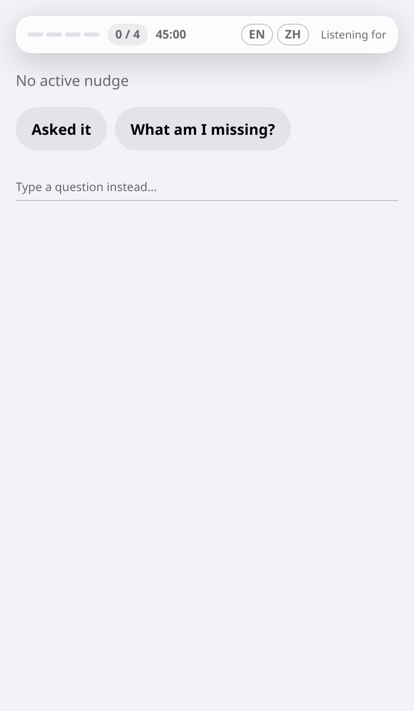
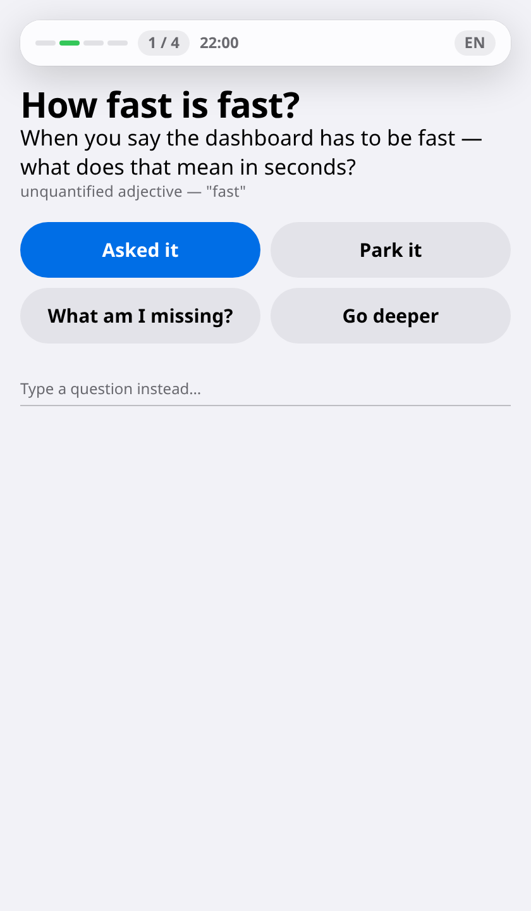
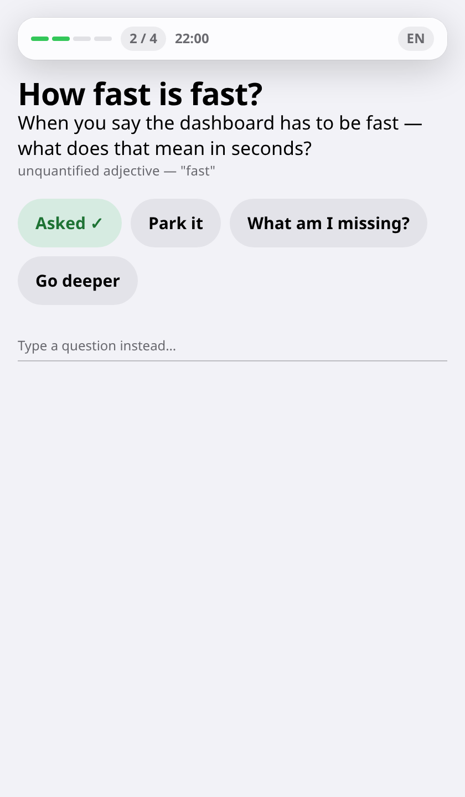

# 3. Catch a vague answer while it still matters

*For the person running the meeting · during it*

This is what Elicta is for. A client says something that sounds like an answer
but is not one, and five seconds later you ask the question that pins it down —
instead of thinking of it in the car afterwards.

## Before anyone speaks

The panel shows how much of your template is covered and how long is left, and
nothing else. There is no suggestion because nobody has said anything yet.

An empty panel is the right resting state. Anything shown here would pull your
eyes to a screen during the part of the meeting where you are establishing
rapport.

## Something vague lands

The client says *"the dashboard has to be fast."* That is not a requirement —
it is a feeling. Elicta recognises it and puts one question in front of you.

Three things, in the order you need them: a short version you can read at a
glance without breaking eye contact, the full question if you want to ask it
word for word, and — quietly underneath — why it fired. That last line matters
more than it looks. It is how you tell in half a second whether Elicta
understood the room or misheard it, and whether to trust the next one.

Only one suggestion is ever shown at a time. Earlier ones move below a line and
fade back, still readable if you want them, never competing with the current
one.

## You answer in one tap

You have one hand and no attention, so every response is a single tap:

- **Asked it** — I covered that. The section fills in immediately.
- **Park it** — not now; keep it for the debrief.
- **What am I missing?** — show me the most urgent thing not yet covered.
- **Go deeper** — that answer opened something; follow it.

Tapping *Asked it* fills the section in front of you straight away rather than
waiting for anything to confirm. Your confirmation is what you can see, not a
round trip you would never notice.

There is also a text box at the bottom for typing your own question. It is
deliberately the quietest thing on the screen — a way out, not the way to work.

## Where this stands

| | |
|---|---|
| ✅ Ready | The panel itself: the running coverage count and time remaining, the suggestion and the line saying why it fired, all four one-tap responses, and the box for typing your own. It is connected to the meeting's live session, so whatever that session sends appears here |
| ✅ Ready | Your taps are recorded against the meeting and sent back, so the debrief knows which suggestions you used and which you set aside |
| ✅ Ready | The microphone. The desktop app opens the device, offers the audio interface and the silent-join path, and releases it when you stop |
| ✅ Ready | Something to put in the panel. What the microphone hears is turned into words during the meeting, checked for the kind of vagueness that costs a requirement — an amount with no number, an adjective with no threshold, a date that is not a date, a commitment behind a hedge — and a question is put in front of you. Verified end to end against a real recording |
| ✅ Ready | The question comes from the bank drafted before the meeting, chosen for the word you actually heard rather than for how highly it was ranked. Where the bank has nothing about that word, the question is built from the word itself, so the panel still works when no model can be reached |
| ✅ Ready | At most one suggestion a minute, however much passes the check. The limit matters more than it sounds: a panel that interrupts more often than that stops being read, and it stops being read for the rest of the meeting |
| ⏳ Not yet | Hearing across a pause. The recogniser is given four seconds at a time and nothing listens for the ends of sentences, so a phrase landing on the join between two of them can be missed. What is heard is accurate; what is missed is silent |
| ⏳ Not yet | The other three ways a question can be earned — an action with nobody named as doing it, an answer that contradicts a document you supplied, a system or team nobody has mentioned before. Only the wording checks are built, and they are the ones that need no model |
| ⚙️ Setup | Hearing the meeting needs a speech provider configured in Settings; without one the panel stays at its resting state and the recording is unaffected. Once configured it is charged by that vendor for every few seconds of audio, silence included, for as long as the recording runs |
