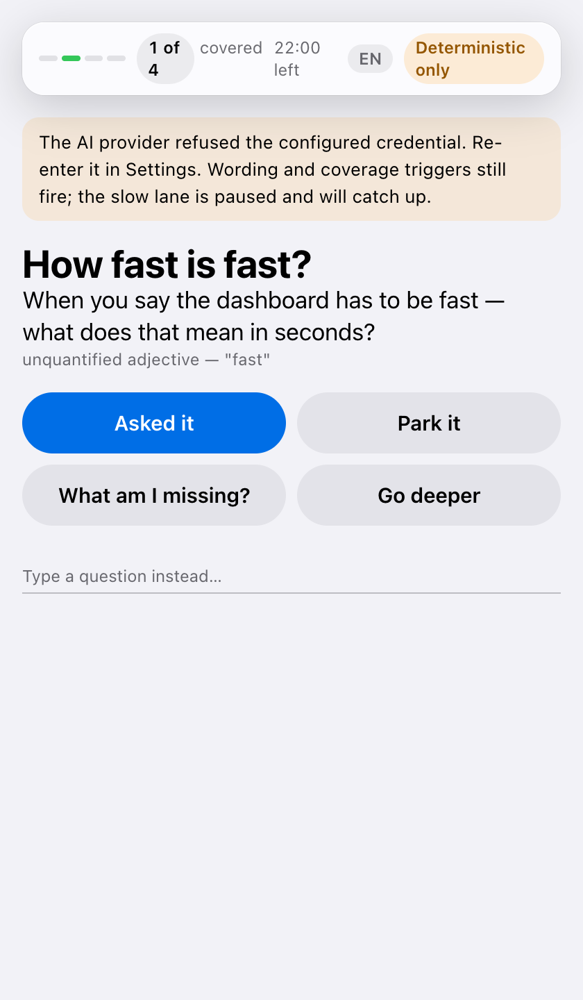

# 5. When the connection drops

*For the person running the meeting · when something breaks mid-meeting*

Networks fail in client offices. Elicta is built in two halves specifically so
that when the clever half cannot be reached, the meeting does not stop — it
just gets quieter.

## What still works

The fastest and most valuable suggestions never needed the internet. Spotting
an unquantified word like *fast* is pattern matching against a list prepared in
advance, and losing the connection does not touch it. Coverage tracking and
every button on the panel are local too.

What pauses is the slower, cleverer layer: noticing that an answer contradicts
something said twenty minutes ago, or that a system just mentioned appears
nowhere in the briefing pack.

The honest caveat is that the fast path is not producing suggestions today
either — not because the connection dropped, but because nothing transcribes
the meeting yet. The two-speed split is real and the degraded half is the half
that does not need a model; it is waiting on the same missing piece as
everything else that listens.

## You are told, not left to guess

The panel says which mode it is in and what that means. The alternative — going
quiet and letting you assume there was nothing to ask — is the one behaviour
that would genuinely mislead you.

The mode is read from what actually happened on the wire, not from whether a
provider was set up. A key that stopped working, a provider having an outage, a
throttled account and a plan that does not include the model are four different
problems with four different fixes, and the panel names which one it met rather
than collapsing them into "unreachable". A provider nobody has called yet is
reported as fine, because unproven is not the same as broken.

Nothing is invented while the connection is down. Work that needed the missing
piece is recorded as not done, with the reason, and the write-up says so
instead of quietly coming back shorter.

## Where this stands

| | |
|---|---|
| ✅ Ready | The two-speed design, the panel's degraded state, and honest recording of what could not be completed |
| ✅ Ready | The panel is told which mode it is in by the live connection itself, before it shows you a single suggestion — so a quiet panel is never ambiguous between “nothing to say” and “the model is unreachable” |
| ✅ Ready | **The mode reflects the connection, not the setup.** It used to be decided by whether a provider had been configured — a fact settled when Elicta started, which no outage, expired key, throttle or plan limit could change. A journey about the connection dropping could not detect one dropping. Now every call to a provider reports what it found, and the panel names which of the four problems it met, because the remedies are different. Recovery clears it without a restart |
| ✅ Ready | **A short write-up says why it is short.** When a stage of the write-up cannot reach a model the chain stops there rather than guessing, which is right — but the screen then showed fewer artifacts and no explanation, which reads exactly like a meeting where nothing was decided. The stage that stopped and the reason it gave were both recorded all along, into a place nothing read. The debrief screen now says which stage stopped and what it reported |
| ✅ Ready | **The one call that carried the most now leaves a record.** The debrief conversation sends a whole meeting's transcript to a provider so you can ask questions about it, and it was reaching the provider directly rather than through the audited boundary — so it was the single call writing no entry in the log of what left the machine, and telling the panel nothing when it failed. It goes through the boundary now |
| ⏳ Not yet | **Detecting a drop while nothing is being asked of the provider.** The mode is read from real calls, so a connection that fails between them is not noticed until the next one. There is no background health check on purpose: a probe answers a question nobody asked and can disagree with the calls that matter |
| ⏳ Not yet | **The slower layer itself.** The periodic slow-lane turn records that it ran and reaches no model at all, so the cleverer half being described here has nothing behind it yet. That is a missing feature rather than a degraded one, and it does not change what the panel says about the connection |
