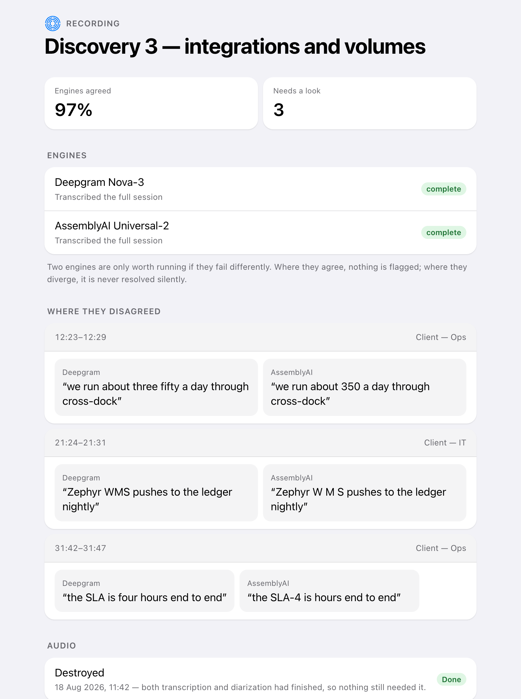

# 6. Check the recording

*For the person running the meeting, or a reviewer · afterwards*

During the meeting, transcription is tuned for speed — a suggestion that
arrives late is worthless. Afterwards it is tuned for being right, because
everything written up comes from this version and not from the live one.

## Two transcribers, on purpose

The recording is transcribed twice by two different companies. Not for
redundancy — for disagreement. Where two independent services produce the same
text, it is almost certainly right and needs nobody's attention. Where they
differ, something was genuinely unclear, and that is exactly what a human
should look at.

The two readings sit side by side because you are comparing them. Stacked, it
becomes a memory exercise.

Disagreements are always flagged, never quietly resolved by picking a winner.
The whole value is in surfacing the doubt.

For the same reason the screen refuses to put a number on an agreement it has
not measured. A meeting with no pair of transcripts to compare says so, rather
than reporting that the engines agreed on none of it — which is what it used to
say, beside a count of nought disagreements, on the same screen at the same
time.

## Then the audio is destroyed

The moment both transcriptions and the speaker identification have finished —
whether they succeeded or failed — the recording is deleted and the deletion is
recorded. Nothing still needs it, and keeping it only widens what could be
exposed if something went wrong later.

## Where this stands

| | |
|---|---|
| ✅ Ready | Comparing two transcripts, flagging every disagreement, and the automatic destruction of the audio — the last of which a live run photographed working, with the reason recorded beside it |
| ✅ Ready | **Refusing to report an agreement it has not measured.** A live run showed "Engines agreed 0%" next to "Needs a look 0" — two engines that had finished, no disagreements between them, and a headline saying they matched on nothing. Both numbers were on screen at once and they contradict each other. The screen now says nothing was compared, and separates that from the engines having agreed throughout, because an operator acts on those differently |
| ✅ Ready | **Both transcribers are real, and both complete.** Given the same raw, chunked linear16 audio the capture pipeline produces — posted chunk by chunk the way this journey describes, out of order once to confirm the gap is refused rather than silently joined — Deepgram and AssemblyAI both return COMPLETE transcripts from the real vendor. AssemblyAI needed a fix first: it was handed the identical headerless PCM Deepgram accepts, and its transcoder rejected it as an unrecognised file type, where Deepgram is told the encoding and sample rate on the request itself. Wrapping the same bytes in a plain WAV container before upload — no re-encoding, nothing about the audio changes — is what made it complete. The engagement's own vocabulary reached both vendors on the wire: Deepgram spelled a product term and a person's surname correctly; AssemblyAI, boosted with the same two terms, got the product term right and still misheard the surname — itself exactly the kind of disagreement this pairing exists to catch. Full diarization over the same audio told the two real speakers apart into two distinct tags rather than one — R7, open since the first spikes used a single narrator, is closed |
| ✅ Ready | **A live `SessionAlignment` now exists, with real measured divergence.** Comparing the two real transcripts over the same 57-second recording produced 13 aligned spans, agreement scores from 0.11 to 0.82, every span flagged divergent — including the misspelled surname above (Deepgram: "Peter DeCarlo"; AssemblyAI: "Peter DiCarlo"). Read plainly rather than as unqualified success: the two vendors split the recording into a different number of utterances (13 against 8), so a short span's comparison window often pulls in extra neighbouring words from the other engine, which alone is enough to fail an exact-word match — "13 out of 13 divergent" therefore overstates how differently the two vendors actually heard this recording, and a cleaner read of agreement-versus-disagreement on well-aligned boundaries has not been seen yet. What has been seen, for the first time, live and against two real vendors on real audio: the comparison runs, and it surfaces a genuine mishearing, not nothing |
| ✅ Ready | The check for that is now built: given a recording and a correct transcript, it reports what share of the mistakes the pairing would actually have shown you. A sample containing no mistakes reports “cannot tell” rather than a clean pass, because it is no evidence either way |
| ⏳ Not yet | The check still has to be run against real client recordings. We can measure the answer now; we do not have it yet |
