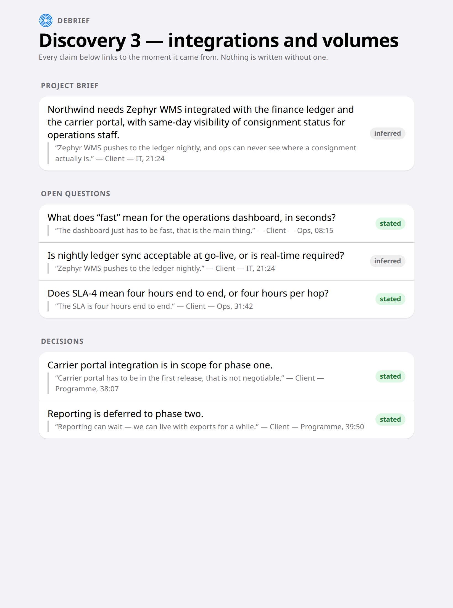
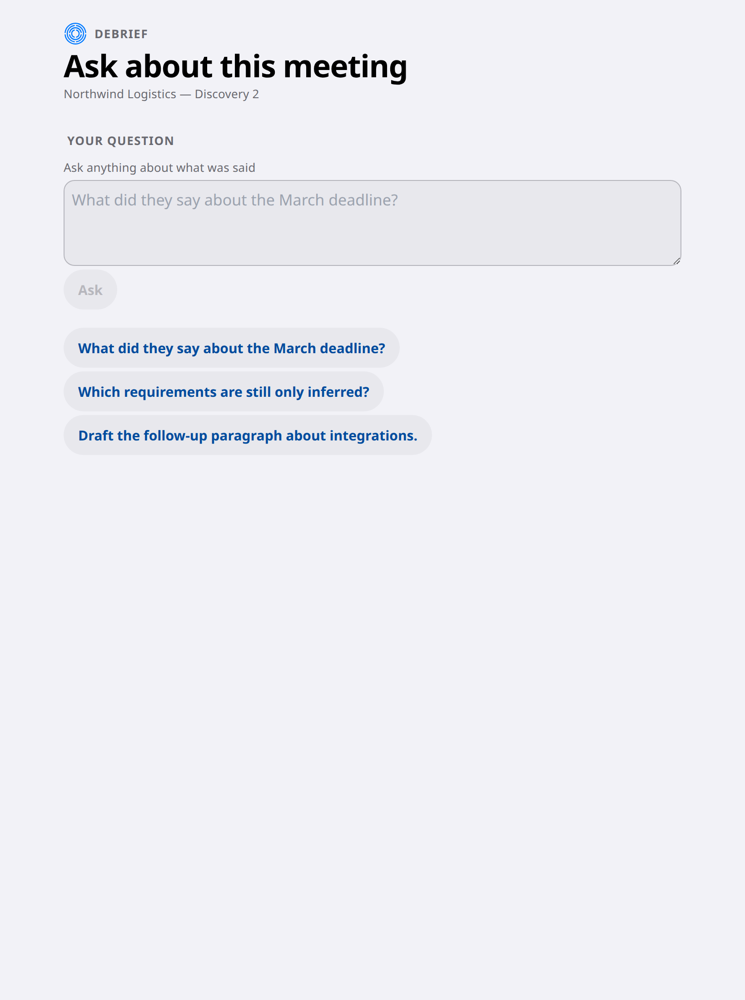
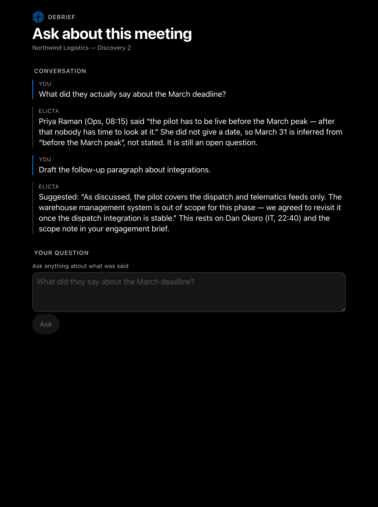

# 7. Get the write-up

*For the person who ran the meeting, and whoever reviews it · afterwards*

The meeting produces a transcript. What you actually need is a set of documents
someone can act on, where every claim can be traced back to the moment it came
from.

## What comes out

Open questions ranked by how much they matter to the build, a log of what was
decided and by whom, a draft project brief, and a follow-up email covering what
you heard and what you still need.

## Said, or worked out

This is the distinction a reviewer cares about most, so it is on the face of
every claim rather than buried:

- **Stated** — the client said this. The quote is right there with who said it
  and when.
- **Inferred** — Elicta concluded it. Also with the quote it was concluded
  from, so you can judge whether you agree.

Blurring those two would make the whole document untrustworthy, so nothing can
be written without a source attached. It is not a habit or a review step; a
claim without one cannot be saved.

## Asking about the meeting directly

The documents above answer the questions someone anticipated. For the ones
nobody did — *what did they actually say about the March deadline*, *draft the
follow-up paragraph about integrations* — you can ask in your own words.

Before you have asked anything, the screen offers a few openers and says
plainly where its answers come from.

Answers quote and attribute rather than summarise, and say plainly when
something was inferred rather than stated. That is the same rule the documents
follow, for the same reason: an answer you cannot check is one you have to take
on trust, and this is not a product that asks for trust.

## Where this stands

| | |
|---|---|
| ✅ Ready | The whole sequence is built — cleaning up the transcript, translating while keeping the original, sorting statements into template sections, drafting the documents, and attaching every source |
| ✅ Ready | If any step fails, the sequence stops there and says so, rather than passing invented material to the next step |
| ✅ Ready | **And now it says so where you can see it.** A run that stops leaves the screen with fewer documents on it, which reads exactly like a meeting where little was decided. The screen names the step it stopped at and whether something was not set up or a call did not get through. That sentence is written for you: the step's own record, which is written for whoever maintains the pipeline, is kept out of it |
| ✅ Ready | Asking follow-up questions in your own words works, live and against a real provider. You can query the meeting, ask for a paragraph to be drafted, and every answer names the moment it rests on — proven in a live run, not just in principle |
| ⏳ Not yet | **The documents themselves, and the reason is the first step, not capacity.** This page used to say the account was rate limited. A live run against a working provider produced no documents either, and the new notice named the cause in one line: the sequence stops at *telling the voices apart*, which needs a speech service, and none is connected. Everything after that step is waiting on the same missing piece as journeys 3, 4 and 6 |
| ⏳ Not yet | The four documents, the artifact list and the citations on screen all follow from the step above. They are built and tested; none of them has been produced from a real meeting |
