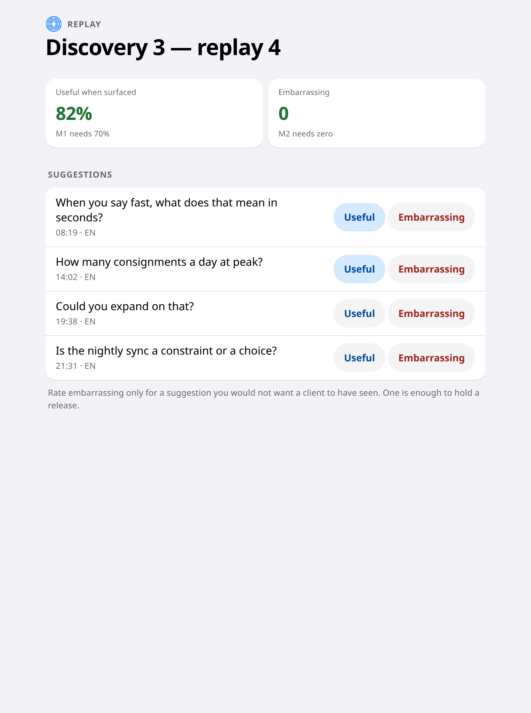
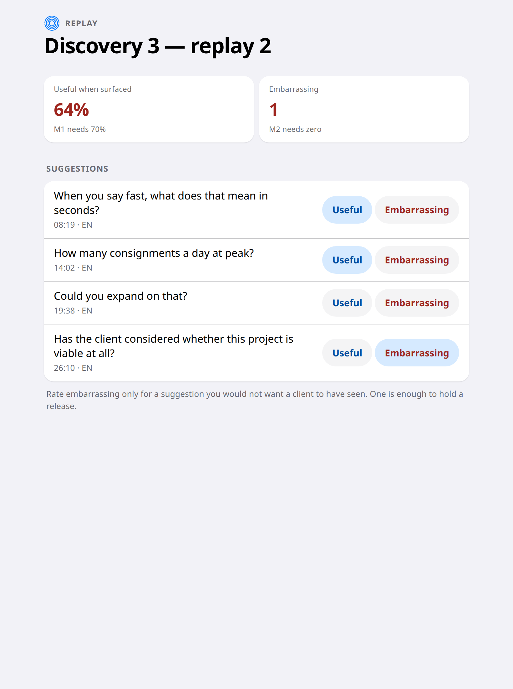

# 9. Judge whether the suggestions are any good

*For the delivery lead · between engagements*

Whether a suggestion was worth interrupting a meeting for is a judgement, not a
measurement. So it is made by a person, on real meetings, and it decides
whether a version ships.

## Replay a real meeting

A recorded meeting is run through Elicta again exactly as it happened. Nothing
is sent anywhere and nothing costs anything — it is replaying its own past
behaviour, which also means the result is repeatable.

You then rate what it suggested, on two separate scales:

- **Useful** — worth the interruption.
- **Embarrassing** — you would not have wanted the client to see it.

These are deliberately not opposites. A suggestion can be a waste of a moment
without being humiliating, and the two carry very different consequences.

## Two bars, and one of them is absolute

At least **70%** of suggestions must be rated useful. And the number of
embarrassing suggestions must be **zero** — not low, zero. One is enough to
hold a release, which is why the two ratings are never combined into a single
score that could average an embarrassment away.

## Where this stands

| | |
|---|---|
| ✅ Ready | Replaying meetings, rating suggestions, both quality bars, and automatic blocking of a release that fails either |
| ⏳ Not yet | Both bars are judged per language, so adding a language means finding a fluent rater with business-analysis experience — not just translating a word list. Worth planning for early |
| ✅ Decided | The starting weights are now chosen rather than left at a placeholder, and the reasoning is written down: say less, more confidently, because a suggestion that misfires in front of a client costs more than one that never fires. A question you have already asked can never be suggested again ahead of one you have not — that is guaranteed by the numbers themselves, not left to chance |
