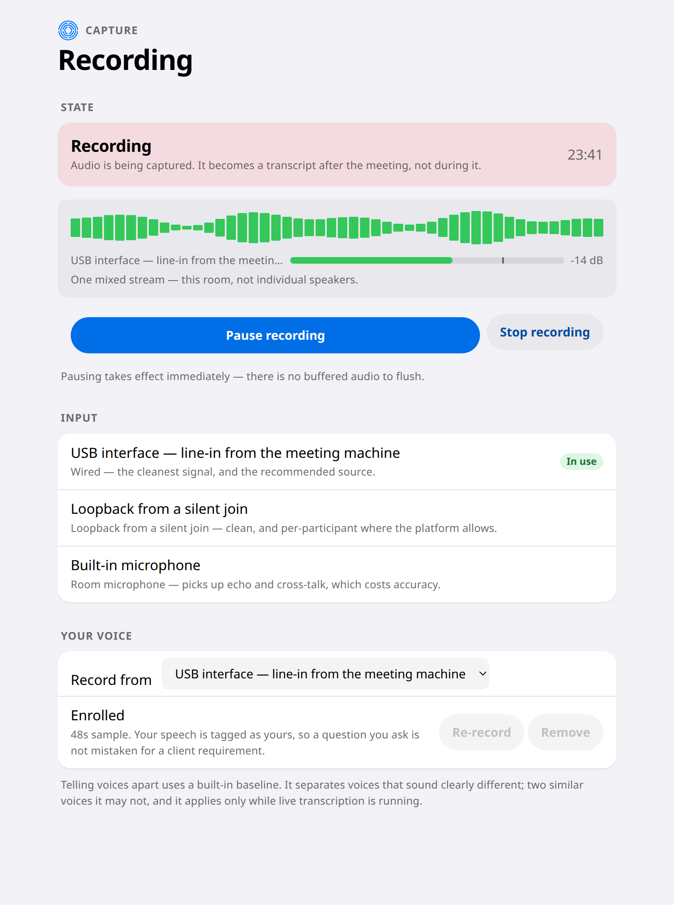
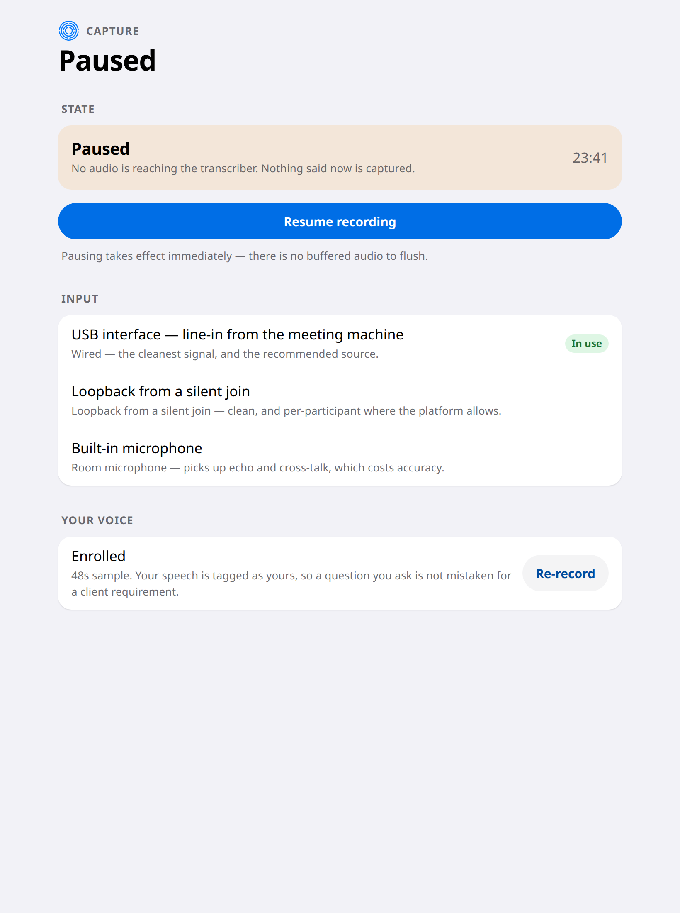
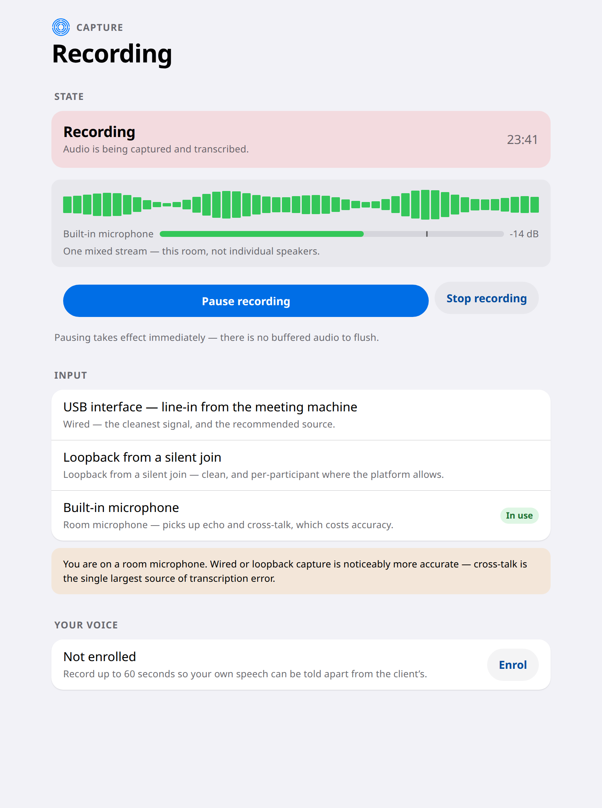

# 11. Control the recording while the meeting runs

*For the person running the meeting · during it*

Two controls here are safety features rather than conveniences, and they shape
everything about the screen.

## Pause is one tap, and always in the same place

You reach for pause when a client says *"can we take this bit off the record."*
A control that needs hunting for — or that asks whether you are sure — fails at
exactly that moment. So it runs the full width of the screen, never moves, and
takes effect immediately. There is no buffered audio still on its way.

## You can tell what state it is in without reading carefully

Believing you are paused while still recording is the worst thing this product
could do to you. So the state is said three ways at once — the word, the
sentence under it, and the colour — and never by colour alone, which also means
it works if you cannot distinguish those colours.

## It argues for the better microphone

Elicta does not just accept whatever audio it is given. Wired input, or a
silent join, is markedly more accurate than a microphone in the middle of a
table — people talking over each other is a bigger source of error than the
choice of transcription service.

So a room microphone gets a warning that stays on screen, rather than a dialog
at the start that everyone dismisses.

## Your own voice

You can record up to a minute of yourself so Elicta can tell your speech from
the client's. Without it, a question *you* asked can be recorded as something
the client wanted — and that error carries all the way into the write-up.

## Where this stands

| | |
|---|---|
| ✅ Ready | Pause and resume, the state display, and the input warning |
| ✅ Ready | Pause now pauses a real microphone. Audio captured while paused is discarded rather than held back, and resuming is instant because the device is never closed |
| ✅ Ready | **A control that cannot work now says why.** A live run photographed a greyed-out "Start recording" beside an empty input list, with no explanation anywhere on the screen — the page was secure and the browser offered microphone access, so both existing checks passed and the screen concluded there was nothing to explain. The machine simply had no microphone. That case now says so, because an operator can act on "no microphone" and can do nothing at all about a dead button |
| ✅ Ready | **A check before the meeting, and a choice of input.** Check microphone opens the chosen input, shows a live level and records nothing — which is also what makes a browser reveal the real names of its microphones, since it withholds ids and labels until the first permission grant and the picker before that reads "Microphone 1". The checked device is promoted to recording rather than reopened, so there is no second prompt and no gap. It matters that the choice is made here: capture refuses a second session on either backend, so swapping input mid-meeting means stopping and restarting |
| ✅ Ready | **Starting a recording is what books the meeting.** The consent screen used to carry a Start button that registered a session and opened no microphone, so an operator was told a meeting had begun while nothing was listening — and it offered no way to pick an input, being a screen that cannot show one working. Both moved here. The device is opened before the meeting is registered, so an input that will not open books nothing |
| ⏳ Not yet | **Recording your own voice.** The screen offers it and the button does nothing yet, so every voice in the room is still treated the same way — which is the error the section above describes, still waiting to be prevented |
