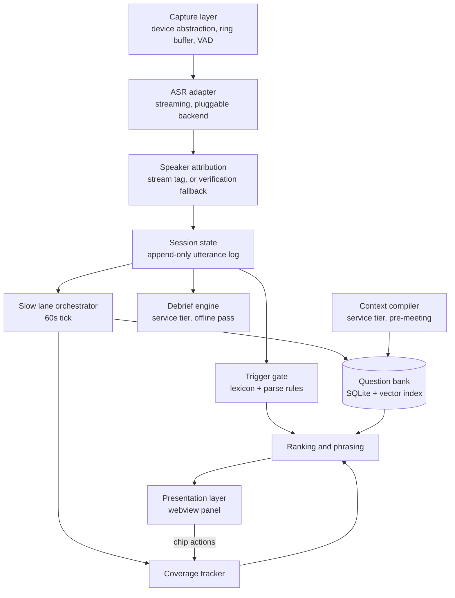

# Technical Architecture — Live Requirements Elicitation Assistant

**Status:** Draft for engineering review
**Companion to:** `live-elicitation-assistant-prd.md`
**Last updated:** 18 August 2026
**Reviewers required:** Eng Lead, Infosec, Legal/Contracts, IT Endpoint

> **Revision note.** This revision brings §2–§8 forward onto the decisions recorded in §12. The body previously described a local-first, single-platform Swift application — the architecture that ADR-005, ADR-006 and ADR-007 replaced. Superseded and retired decisions are archived in §12.1 rather than carried inline.

---

## 1. Architectural thesis

One idea carries this system: **the reasoning happens before the meeting; the meeting only does selection.**

A naive implementation sends the live transcript to a large model and asks for a good follow-up question. That path costs 3–6 seconds — outside the conversational window — and it degrades under exactly the conditions where you need it most, because a stuffed context inflates prompt processing.

Instead, a batch job runs the expensive analyst reasoning offline and emits a bank of pre-reasoned, pre-phrased candidate questions. At runtime the system matches conversational state against that bank. Matching is a retrieval and scoring problem measured in tens of milliseconds, not an inference problem measured in seconds.

The second-order consequence is the one that matters for the build: **the highest-value trigger path contains no model call at all.** Detecting an unquantified adjective is a lexicon scan; responding to it is a template instantiation against a pre-written candidate. End to end, under 100ms. This refines NFR-1 in the PRD — the 300–800ms selection budget applies only to model-assisted triggers. For the deterministic path, our contribution to latency is negligible and total time-to-nudge is dominated by ASR endpointing, which we do not control.

Build the deterministic path first. It is faster, cheaper, more reliable, and carries most of the value.

---

## 2. System context

```
┌──────────────────────────────────────────────────────────────┐
│  Operator device — Tauri 2 shell over the shared Rust core    │
│  macOS · Windows at v1 · mobile as companion (§11.2)          │
│  · capture: line-in, loopback, acoustic fallback  [core]      │
│  · trigger gate, bank, ranking, session state     [core]      │
│  · presentation                                   [webview]   │
└───┬──────────────────────────┬───────────────────────────────┘
    │ slow lane                │ sessions, artifacts, sync
    │ Messages API             │
    │ ≤1 req/60s               │
    ▼                          ▼
┌─────────────┐   ┌────────────────────────────────┐
│  Claude     │   │  Service tier (Python/TS)       │
│  Messages   │◀──│  · context compiler             │
│  API        │   │  · debrief engine               │
└─────────────┘   │  · record-path transcription    │
                  │  Claude Agent SDK               │
                  └───┬────────────────────────────┘
                      │
   ┌──────────────────┼───────────────────┐
   ▼                  ▼                   ▼
┌─────────┐   ┌────────────────┐   ┌─────────────┐
│ Managed │   │ Streaming ASR   │   │  Batch ASR  │
│ capture │──▶│ (live path)     │   │  ×2         │
│ (vendor)│   └────────┬────────┘   │  (record)   │
└─────────┘            │            └─────────────┘
  per-participant      └──────────▶ core trigger gate
  streams (FR-2.10)
```

**The design splits along a capability line, not a perimeter line.** With C1 withdrawn, "local" is no longer a data-policy position; it is a latency position, and only latency-critical work earns a place on the device.

- **In the shared core, on the device**: everything with a hard real-time or sub-second constraint — capture, trigger gate, bank retrieval, ranking, session state. These are local because they are latency-critical. The core ships once, in Rust, on every platform (ADR-013, NFR-3.2).
- **In the service tier**: everything agentic or batch — context compiler, debrief engine, record-path transcription. This is where the Claude Agent SDK runs, and it is a Python/TypeScript service because the SDK is a library for Python and TypeScript only; driving the same agent loop from another language means running the CLI as a subprocess with `-p` and `--output-format json`. Neither a Swift nor a Rust client can host it natively, and bundling a Node runtime into a signed, notarised desktop app is strictly worse than a service (ADR-010, C3).
- **External**: managed capture for per-participant streams, and ASR vendors on both paths.

The single audited egress chokepoint (NFR-2.7) is retained and now matters more, since there are several external processors rather than one. §8 states where it lives now that there are two hops.

---

## 3. Component architecture



Everything above the dashed capability line in §2 — `CAP` through `UI` — is shared-core Rust. `COMP` and `DEB` run in the service tier.

### 3.1 Capture layer

One `AudioSource` trait, several platform backends, selected at runtime in the priority order set by FR-1.1 and FR-1.2:

| Path | Backend | Notes |
|---|---|---|
| Managed per-participant streams | Vendor SDK over the service tier | Preferred wherever the meeting platform is supported (FR-2.10) |
| Line-in from a USB interface | CoreAudio (mac) · WASAPI (Win) | No roster entry; works with dial-in |
| Loopback from a silent local join | ScreenCaptureKit or the CoreAudio process-tap API (mac) · WASAPI loopback (Win) | Loopback is first-class on Windows and a retrofit on macOS |
| Acoustic | Same input APIs, external omni mic | In-person and degraded mode only; warn on selection (FR-1.2) |

Normalises everything to 16kHz mono PCM into a lock-free ring buffer. The audio callback runs on a real-time thread — **no allocation, no locks, no logging on that path.** Violating this produces dropouts that manifest as ASR errors nobody traces back to the audio layer. Rust's lack of a garbage collector is what makes it viable here at all (ADR-013).

Silero VAD runs here to gate downstream work and to detect the silence intervals that drive endpointing. It is small enough to run continuously at negligible cost.

Capture state is an explicit machine — `idle → capturing ⇄ paused` — with the paused transition guaranteed to take effect within one buffer period. FR-1.3 is a hard real-time requirement, not a UI affordance: the operator taps pause because a client just said something off the record.

### 3.2 ASR adapter

A `TranscriptionBackend` trait emitting two event types:

```rust
pub struct InterimHypothesis {
    pub stream_id: StreamId,
    pub text: String,
    pub started_at: Duration,
}

pub struct FinalUtterance {
    pub id: Uuid,
    pub stream_id: StreamId,        // participant stream, where capture provides them (FR-2.10)
    pub speaker: SpeakerTag,        // Operator | Participant(id) | Unknown  (FR-2.3)
    pub text: String,
    pub start: Duration,
    pub end: Duration,
    pub tokens: Vec<Token>,
    pub audio_ref: AudioSegmentRef, // retained only until the record path completes (NFR-2.4)
}

pub struct Token {
    pub text: String,
    pub confidence: f32,            // per-word (FR-2.3) — feeds span gating (NFR-5.6)
    pub lang: LanguageTag,          // per-token, not per-utterance (FR-2.13)
    pub lang_confidence: f32,       // gates the deterministic tier (FR-2.22)
}
```

**The token vector is load-bearing, not a detail.** Two of this system's safety mechanisms — span-confidence suppression (NFR-5.6) and language-tag suppression (FR-2.22) — consume per-token data. An utterance type carrying one scalar confidence and one language cannot express either, and a backend that only emits scalars fails FR-2.3 and disqualifies itself. This is a hard filter in the bake-off (T1, T14), not something to discover during integration.

**Two paths, not two implementations of one path.** The trigger engine and the transcript of record have incompatible optimisation targets, and the tension between "high performance" and "high assurance" dissolves once they are separated.

| | Live path | Record path |
|---|---|---|
| Consumer | Trigger gate | Artifacts, citations, coverage (FR-2.7) |
| Latency budget | 500–800ms endpoint-to-text (NFR-1) | None |
| Error tolerance | High — a wrong nudge is rate-limited and ignored | Zero — an error becomes a wrong requirement in a signed PRD |
| Engine | Streaming: Deepgram Nova-3, AssemblyAI streaming | Batch, highest accuracy available (FR-2.5) |
| Redundancy | Single engine | **Two engines, reconciled (FR-2.6)** |
| Accuracy bar | ≤8% entity-weighted WER monolingual, ≤15% code-switched (NFR-5.2, 5.3) | ≤3% Tier 1, ≤6% Tier 2 (NFR-5.4, 5.5) |
| Runs | During the meeting | After, in the service tier (§7) |

`TranscriptionBackend` covers the live path. A separate `BatchTranscriptionBackend` covers the record path and is invoked as step 1 of the debrief pipeline (§7).

**Live path engine selection.** Prefer engines whose streaming output is immutable — where partial hypotheses are appended rather than revised (FR-2.4). Speculative drafting (§5) holds a candidate matched against a partial; if that partial can be rewritten underneath you, every speculative match needs invalidation logic. Immutability removes an entire class of bug. AssemblyAI's streaming tier is built around this property and should be evaluated on it specifically; Deepgram Nova-3 is the latency and accuracy benchmark to beat.

**Record path reconciliation.** Two independent engines transcribe the session; outputs are aligned and compared. Agreement is the confidence signal. Divergent spans are flagged and surfaced to the operator during debrief (FR-2.8) rather than silently resolved by picking a winner — silent resolution is how a plausible-but-wrong requirement reaches a signed document. This costs roughly double on an offline workload with no latency constraint, which is the cheapest assurance available anywhere in the system. Its value depends entirely on the two engines failing *independently* (T3).

**Confidence gating.** Per-word confidence from the live path feeds the trigger gate. If the trigger span itself is low-confidence, the nudge is suppressed (NFR-5.6). Firing `quantify "fast"` when the client said "vast" is an M2 event and this prevents it for the cost of one comparison.

**Endpointing.** Silence threshold is configuration, not a constant, and is tuned per capture mode from a 600ms default (FR-2.2). See §5 for its weight in the budget and **§14.2 for the actual parameter surface** — it is not one threshold, and the two engine families do not expose comparable knobs.

**Custom vocabulary** (FR-2.9) is injected per session on both paths. This matters more than it appears: client system names and internal acronyms are precisely the tokens that drive novel-entity triggers, and a misrecognised product name produces a spurious nudge. Modern keyterm prompting handles this far better than the old phrase-list approach.

**Measurement.** Entity-weighted WER (NFR-5.1), computed per language and per capture mode (NFR-5.7). Overall WER hides exactly the failures that matter here. The accuracy levers themselves, ranked by effect, are in §14.1 — the first two are ours rather than the vendor's.

### 3.3 Speaker attribution

The trigger gate needs one bit per utterance: *is the person who just finished speaking someone other than me?* There are two ways to get it, and the capture mode decides which.

**Primary — stream identity.** Managed per-participant capture (ADR-011) delivers one audio stream per participant, so the bit is a property of the stream and costs nothing. This is the preferred path and it eliminates runtime diarization entirely (FR-2.10 rationale).

**Fallback — on-device verification.** Where capture is mixed-stream — line-in, acoustic, in-person (FR-1.1) — an ECAPA-TDNN-class speaker embedding model runs against the utterance's audio segment, producing a cosine similarity to the operator's enrolled voiceprint (FR-1.5). Single threshold, binary output: `operator` or `other` (FR-1.6). ~15ms per utterance.

This fallback is deliberately not diarization. Open-set diarization across three client stakeholders in real time is a hard problem with a poor accuracy floor; single-speaker verification against an enrolled print is comfortably solvable. Full attribution runs in the debrief pass (§7) where latency is irrelevant and a much better algorithm is affordable.

`SpeakerTag` is therefore populated from the stream on the primary path and from verification on the fallback path, and nothing downstream needs to know which.

### 3.4 Session state

An append-only log of utterances plus derived views. Everything downstream reads from here rather than from the ASR stream directly, which keeps the trigger gate, coverage tracker and slow lane decoupled from transcription timing.

Materialises two views on demand: a **rolling window** (last 60–90 seconds, verbatim) for the slow lane, and a **structured state summary** (covered sections, open threads, decisions, contradictions) that is far smaller than the transcript and is what actually carries context forward. The full transcript is never sent to the slow lane.

### 3.5 Trigger gate

Two tiers, both reading from session state. FR-5.1 requires every finalised utterance to be evaluated; the gate refines this by evaluating only utterances whose `speaker` is not `Operator`, since a nudge prompting the operator to interrogate their own sentence is never useful.

**Language routing.** The gate does not receive an utterance language — it receives per-token language tags (FR-2.13) and routes accordingly:

```
utterance tokens ──▶ group by language tag
                       ├─ zh tokens ──▶ zh segmenter ──▶ zh lexicon
                       └─ en tokens ──▶ en tokeniser ──▶ en lexicon
                                              │
                       merge spans ◀──────────┘
                       drop spans below tag-confidence threshold (FR-2.22)
```

**This is not the detect-then-route pipeline FR-2.12 prohibits.** That prohibition governs transcription: the ASR must be an end-to-end multilingual model that makes no language decision before transcribing. Routing here happens *after* transcription, over tags the model has already emitted as a by-product. No decision gates the audio path, and no latency is spent identifying a language.

Utterance-level language assignment is not viable regardless. 这个 API 的 latency 要求是什么 has no single language, and forcing a choice discards whichever half loses — on precisely the sentences that dominate APAC meetings. Token-level tags make the gate a routing problem rather than a classification problem.

Tag confidence gates the deterministic tier: low-confidence tokens do not produce nudges. This is the same reasoning as span-confidence gating (NFR-5.6) applied one level up — an uncertain language tag means an uncertain lexicon match, and firing on it is an M2 event.

**Deterministic tier — synchronous, <20ms, no model. Language-specific.**

| Trigger | English implementation | Portability |
|---|---|---|
| Unquantified adjective / vague quantifier (FR-5.2) | Aho–Corasick over a curated lexicon; returns matched span | **Rebuild per language.** Not translatable |
| Unnamed actor (FR-5.3) | Dependency parse; passive constructions and agentless clauses | **Does not transfer to pro-drop languages.** Requires a per-language strategy or omission |

Languages without orthographic word boundaries require a segmentation stage before lexicon matching (FR-2.18). The pipeline is `segment → match`, not `match`, and the segmenter is per-language.

**The pro-drop problem is the important one.** Chinese, Japanese, Korean and others omit subjects as ordinary grammar rather than as evasion. An English-derived agentless-clause detector fires on a large fraction of well-formed sentences in these languages — not a precision degradation but a precision collapse, breaching FR-5.7 within minutes. For any pro-drop Tier 1 language, either build a language-specific evasion heuristic or ship without FR-5.3 in that language (T11). Do not port the English rule.

**Model-assisted tier — asynchronous, never blocks, language-agnostic.** Contradiction (FR-5.4), novel entity (FR-5.5), and coverage-gap-plus-drift (FR-5.6) are evaluated in the slow lane and land as nudges on a later tick. They are *not* on the critical path, and treating them as if they were is the mistake that would blow the latency budget.

Because this tier operates on semantic understanding rather than surface form, it generalises across languages without additional work. **This is what makes Tier 2 language support viable** (PRD §8.2a): a Tier 2 language loses the deterministic tier and retains this one, degrading from ~800ms nudges to 60s nudges rather than to nothing.

Note the inversion this creates. In English, the deterministic tier carries most of the value and should be built first. In every Tier 2 language, the model tier carries all of it. Build priority is therefore per-language, not global.

Output is uniform:

```rust
pub struct TriggerEvent {
    pub kind: TriggerKind,
    pub utterance_id: Uuid,
    pub span: Option<Range<usize>>, // byte range of the offending phrase
    pub confidence: f32,            // minimum token confidence across the span
}
```

The gate enforces FR-5.7 at this boundary — it maintains a rolling pass-rate counter and raises its own thresholds if pass rate exceeds ~10% of utterances. Self-regulating, so a chatty meeting does not become a noisy panel.

### 3.6 Question bank

Local SQLite with a vector index (sqlite-vec, or a flat index — at a few hundred candidates, brute-force cosine is sub-millisecond and an approximate index is unnecessary complexity). The PRD sizes a compiled bank at ~200 candidates; the retrieval design is insensitive anywhere below a few thousand.

```sql
CREATE TABLE candidate (
  id              TEXT PRIMARY KEY,
  engagement_id   TEXT NOT NULL,
  template_section TEXT NOT NULL,
  trigger_types   TEXT NOT NULL,      -- JSON array
  phrasing        TEXT NOT NULL,      -- may contain {slot} placeholders
  stub            TEXT NOT NULL,      -- 3–5 word glanceable form
  lang            TEXT NOT NULL,      -- meeting language this phrasing is for (FR-2.24)
  priority        INTEGER NOT NULL,
  requires        TEXT,               -- JSON array of prerequisite candidate ids
  authority_match TEXT,               -- roles that can answer this
  source_doc      TEXT,               -- provenance, for hypothesis-derived questions
  embedding       BLOB NOT NULL
);
```

`phrasing` containing slots is what enables the model-free hot path. A candidate stored as `"What's the slowest {term} the {function} team would still accept?"` is instantiated with the client's actual word from `TriggerEvent.span` and the attendee roster. String interpolation, not inference.

`lang` exists because nudge phrasing must render in the *meeting* language while the stub and trigger reason render in the *operator's* language (PRD §8.2b). Those are independent axes, so a bank compiled for a mixed-language engagement holds phrasings in more than one language.

### 3.7 Ranking and phrasing

Pure function, no I/O beyond the local index:

```
score = w₁·trigger_match
      + w₂·coverage_urgency      (unfilled section × time pressure)
      + w₃·authority_match       (can someone in this room answer it?)
      + w₄·priority
      − w₅·recency_penalty       (similar nudge surfaced recently)
      − w₆·asked_penalty         (operator tapped "Asked it" on this thread)
```

Weights are configuration, tuned against the replay harness (§9), not hardcoded. Candidates whose `requires` prerequisites are unsatisfied are filtered before scoring.

Phrasing takes the slot-instantiation path when the winning candidate has one; falls back to a small-model rewrite only when the slow lane has injected a novel candidate lacking pre-written phrasing. `max_tokens` is set to enforce FR-6.1 at the API boundary — a prompt instruction is not enforcement.

### 3.8 Slow lane orchestrator

Fires on a 60-second tick (FR-5.10). Assembles a request against a deliberately partitioned prompt:

| Segment | Volatility | Cached |
|---|---|---|
| System instruction, elicitation technique set | static | ✅ |
| Engagement context digest | static per engagement | ✅ |
| Template definition | static | ✅ |
| Attendee roster and authority map | static per meeting | ✅ |
| — cache boundary — | | |
| Rolling transcript window (60–90s) | every tick | ❌ |
| Structured state summary | every tick | ❌ |
| Recently surfaced nudges | every tick | ❌ |

Placing the boundary correctly caches upwards of 90% of prompt tokens. Get it wrong — by, say, putting the timestamp at the top of the prompt — and every request is a cache miss and time-to-first-token alone consumes the budget. This is the single most common way a design like this fails performance review.

Returns coverage updates, contradiction findings, and novel candidates written back into the bank. It never blocks the fast lane; a slow-lane failure degrades the system to deterministic triggers only (NFR-4.1).

Cache economics, TTL choice, the overlapping-tick trap and the pre-warm are in §14.3. Two rules from there are load-bearing here: never allow two ticks in flight, and never switch models mid-meeting.

### 3.9 Presentation layer

The Tauri webview renders the nudge panel and nothing else — no audio, no gate logic, no state of record (ADR-014). It receives rendered nudges and coverage state over IPC and emits chip events back.

The nudge queue enforces FR-5.8 rate limiting at render time rather than at generation — this matters because generation is bursty and the display must not be. Streaming is disabled in live mode (FR-6.4); nudges are rendered complete via a single state mutation. Chip taps mutate coverage state in the core synchronously and locally; there is no network round trip.

Two-tier rendering (FR-6.2) draws the stub and trigger reason in the operator's language and the question itself in the meeting language (PRD §8.2b) — the panel is bilingual by construction, not by configuration.

### 3.10 Context compiler

Batch, offline, minutes not seconds. Document ingestion and chunking, entity and claim extraction, then the BMAD Analyst pass that emits the candidate bank. Runs when an engagement is created and re-runs per meeting (FR-4.8) weighted toward the inherited open-questions list.

This is where model spend goes and where it belongs — no latency constraint, full context, best available model. Implemented on the Claude Agent SDK; see §3.11.

### 3.11 Claude Agent SDK usage

The SDK is the right harness for two of the three inference workloads and the wrong one for the third. Using it uniformly would be a mistake.

| Workload | Harness | Why |
|---|---|---|
| Context compiler | **Agent SDK** | Genuinely agentic: reads documents, extracts claims, runs the analyst pass, writes the bank |
| Debrief engine | **Agent SDK** | Multi-turn artifact generation, resumable conversation, structured artifact output |
| Slow lane (60s tick) | **Messages API** | Single-shot structured extraction against a partitioned cached prefix |

**Why the slow lane is excluded.** It is one call, one turn, no tool use, with the prompt deliberately partitioned so ~90% of tokens hit the cache (§3.8). An agent loop adds turns that aren't wanted and abstracts away the cache-boundary control the whole latency design depends on. Use the plain Messages API and keep the prefix under direct control.

**Mapping BMAD onto SDK primitives.** The fit here is unusually clean:

| BMAD concept | SDK primitive |
|---|---|
| Analyst, PM, Architect personas | **Subagents** — isolated context per persona, orchestrated in sequence |
| Templates, elicitation technique set | **Agent Skills** — versioned, filesystem-backed, editable without a redeploy |
| Bank validation, citation integrity | **Hooks** — gate output before it is written |
| Coverage matrix, bank schema | **Structured outputs** — schema-enforced rather than parsed from prose (§14.4) |
| Debrief conversation | **Sessions** — resumable across the arc of an engagement |

Agent Skills carrying the technique set is the important one: it directly serves FR-4.4, and it means delivery leads can revise elicitation strategy by editing files rather than by requesting an engineering change.

**Deployment.** TypeScript via `@anthropic-ai/claude-agent-sdk`, or Python via `claude-agent-sdk` (Python 3.10+), authenticating with an API key. Bedrock and Vertex authentication are also supported via environment variables, which preserves a route back to in-tenant inference should the C1 decision ever be revisited — worth keeping in mind given how recently that constraint was withdrawn.

**Permissions.** The compiler and debrief agents have filesystem tools available. Scope them explicitly: read access to the engagement document set, write access only to the bank and artifact directories. An agent that can read arbitrary paths on a service tier holding multiple clients' requirements data is an incident waiting to be written up. The tenancy model this scoping depends on is unresolved (T8).

---

## 4. Data model

```
Engagement ─┬─ ReferenceDocument (status: ground_truth | hypothesis | superseded)
            ├─ VocabularyTerm
            ├─ Candidate[]                (the bank)
            └─ Meeting ─┬─ Attendee       (role, function, authority, domain)
                        ├─ Utterance[]    (append-only)
                        ├─ TriggerEvent[]
                        ├─ Nudge[]        (surfaced, with disposition)
                        ├─ CoverageSlot[] (template section → fill state → citations)
                        └─ Artifact[]

RequirementsState  — engagement-scoped, carried across meetings:
   open questions (ranked) · confirmed requirements (cited)
   contradictions · decisions and commitments
```

Three invariants the schema enforces rather than trusts:

**Citation integrity.** Every confirmed requirement carries a non-null `utterance_id`. There is no code path that writes a requirement without one. This is how FR-8.7 becomes structurally guaranteed rather than prompt-dependent.

**Inference marking.** Anything generated rather than heard carries `is_inference = true` and renders differently (FR-8.8). A model asked to be honest about inference will be honest most of the time; a schema that cannot represent an unmarked inference is honest every time.

**Original-language retention.** A translated utterance is stored as a translation *of* an original that is never overwritten or discarded (FR-2.19), and a citation across a language boundary renders both (FR-8.7a). Translation is an added field, never a replacement — the failure this prevents is a scope dispute in which the client's actual words no longer exist (R12).

---

## 5. Critical path

```
Client stops speaking
  │
  ├─ VAD silence detection ──────────────────── 0ms  (already running)
  ├─ ASR endpoint wait ──────────────────────── 500–800ms  ⚠ not ours
  ├─ Final transcript emitted
  ├─ Speaker attribution ───────────────────── 0ms managed streams / ~15ms fallback
  ├─ Lexicon scan (Aho–Corasick) ────────────── <5ms
  ├─ Parse check ────────────────────────────── ~10ms
  ├─ Bank retrieval (filtered, few hundred) ─── <20ms
  ├─ Scoring ────────────────────────────────── <5ms
  ├─ Slot instantiation ─────────────────────── <5ms
  ├─ Rate limit check + render ──────────────── ~20ms
  │
  └─ Nudge visible ──────────────────────────── ~565–880ms total
```

**Our controllable contribution is 65–80ms** — 65 on managed per-participant capture, 80 on the mixed-stream fallback where verification runs. Against NFR-1's ≤2.0s p50 budget, the pipeline is spending its time almost entirely in ASR endpointing.

That changes where optimisation effort goes. Do not micro-optimise ranking; it is already three orders of magnitude below the noise floor. Instead:

**Tune endpointing aggressively.** FR-2.2 sets a 600ms default and makes it tunable per capture mode. Moving it to 400ms buys 200ms — more than the entire rest of our pipeline. The cost is more premature endpoints mid-sentence, which the trigger gate must tolerate by re-evaluating when a continuation arrives. Finding the knee in that curve is T2, the highest-value experiment in this document.

**Speculative drafting (FR-5.9)** runs the lexicon scan against interim hypotheses. Since the scan is model-free and idempotent, this is nearly free: match early, hold the candidate, commit or discard at endpoint. Effective latency approaches zero for triggers whose phrase appears early in the utterance. This is why immutable partials (FR-2.4) are an engine-selection criterion — §14.2 gives the concrete signal to match on and the parameter that caps this technique's value.

**Model-assisted triggers are not on this path** and must never be placed on it. They arrive on the next slow-lane tick, which is correct — a contradiction is worth surfacing thirty seconds late; a vague adjective is not.

Instrument at every arrow. Ship the histogram, not an average — p95 is what the operator experiences as "it's laggy", and NFR-1 sets a p95 bar (≤3.5s) as well as a p50.

---

## 6. Concurrency model

| Thread / context | Responsibility | Constraint |
|---|---|---|
| Audio RT callback | Device callback, ring buffer write | No allocation, no locks, no I/O, no logging |
| Capture worker | Resample to 16k mono, VAD | Bounded channel; drops counted and surfaced, never silent |
| ASR worker (async task) | Websocket stream, one per participant stream | Backpressure via bounded queue |
| Trigger task (async, single owner) | Gate evaluation, ranking, phrasing | Serial per meeting; must complete <100ms |
| Slow lane task (async) | 60s tick | Cancellable; failure is non-fatal (NFR-4.1) |
| UI thread (webview) | Panel render, chip handling | No blocking work; IPC messages only |

Session state is owned by a single task behind a command channel, giving serialised mutation without explicit locking — no shared `Mutex`, no lock-ordering discipline to get wrong. The trigger path is deliberately single-threaded: at these timescales, parallelism buys nothing and costs correctness.

The real-time constraint on the audio callback is the reason the core is Rust and the reason the webview never touches audio (ADR-013, ADR-014). A garbage collector or a JavaScript bridge on that thread produces dropouts under exactly the load where the product must work.

---

## 7. Debrief pipeline

Runs post-meeting in the service tier, unconstrained by latency.

1. **Record-path transcription** — two independent batch engines over the retained audio, aligned and reconciled (FR-2.5, FR-2.6). Divergent spans are flagged for operator review, never silently resolved (FR-2.8). Every artifact and citation downstream derives from this output, never from the live transcript (FR-2.7).
2. **Full diarization and attribution** — proper clustering across all participants, replacing the runtime binary tag. On managed per-participant capture this is largely a no-op, since attribution came with the streams; it matters on the mixed-stream fallback paths (FR-7.2).
3. **Audio discarded.** NFR-2.4 governs and revises FR-1.7: raw audio is retained only until the record path completes, then destroyed. Steps 4–8 operate on text only.
4. **Transcript cleanup** — disfluency removal, vocabulary correction, punctuation.
5. **Section classification** — every utterance mapped to template sections, backfilling the coverage matrix.
6. **BMAD agent chain** — Analyst pass over the full transcript, producing brief, coverage matrix, open questions, decision log.
7. **Citation binding** — every claim linked to its `utterance_id` with timestamp and speaker (FR-8.7); cross-language claims bind to the original utterance and its translation together (FR-8.7a).
8. **State merge** — `RequirementsState` updated and carried to the next meeting (FR-8.9).

**Steps 1 and 3 are ordered deliberately.** Transcription and diarization are the only steps that need audio, and the discard happens the moment the last of them finishes. Discarding earlier would leave the record path with nothing to transcribe; discarding later widens the breach radius for no benefit (ADR-008).

The debrief thread inherits live-mode signal — which nudges fired, which the operator took, which they parked (FR-7.4). This is both better grounding for the artifacts and the free labelled data that tunes the ranking weights.

---

## 8. Security architecture

The posture is vendor-assurance-based, not perimeter-based. That is a direct consequence of withdrawing C1, and it changes what the infosec conversation is about: not *whether* client audio leaves the machine, but *which named processors receive it, under what contract, with what retention*.

**Processors in the path.** Managed capture vendor, live-path ASR vendor, two record-path ASR vendors, the Anthropic API, and our own service tier. Each must hold a DPA with no-training-on-customer-data terms and a defined retention window (NFR-2.1), with vendor-side retention set to zero or the minimum available (NFR-2.3) and residency pinned per engagement where supported (NFR-2.2). This is a procurement task with a lead time, not a configuration step.

**Egress control.** NFR-2.7 requires a single audited chokepoint. There are now two hops, so there are two chokepoints and both are in scope: one in the core for device-originated egress (slow lane, session sync) and one in the service tier for everything it fans out to. Both log every outbound request. Optional PII redaction (NFR-2.6) is applied at these boundaries, not scattered through call sites.

**What leaves the device.** On managed capture, audio never transits the device at all — it flows from the meeting platform to the capture vendor to the service tier. On the line-in, loopback and acoustic paths, audio goes from the device to the live-path ASR vendor. In both cases the slow lane sends a rolling 60–90 second transcript window plus a structured state summary, once per minute. The full transcript is never sent to the slow lane.

**At rest.** Transcripts and artifacts in an encrypted database, key in the platform keystore — macOS Keychain with `kSecAttrAccessibleWhenUnlockedThisDeviceOnly`, DPAPI/Windows Credential Manager on Windows. Retention policy driven by the data classification outcome (NFR-2.5, PRD D2). Raw audio is never written to disk on the device; the record path holds it in the service tier only until step 3 of §7.

**In transit.** TLS to every processor. Certificate pinning where the enterprise gateway supports it.

**Threat model note.** The primary risk is not exfiltration by an attacker — it is inadvertent over-collection by us, and withdrawing C1 raised that risk rather than removing it. The mitigation is no longer a perimeter; it is that every path out of the system passes through one of two logged chokepoints, which makes over-collection visible in code review rather than discoverable in an audit.

**Legal dependencies.** L1–L5 in the PRD are blocking on the capture layer, and the capture-vendor decision (T15) now sits inside L3's scope: a managed capture vendor is a sub-processor under client MSAs.

---

## 9. Replay harness

This is engineering infrastructure, not a test suite, and it is the first thing built (PRD phase 0).

```
Recorded meeting audio / transcript
  ↓
Replay driver — emits utterances at original wall-clock offsets
  ↓
Full pipeline (real trigger gate, real bank, real ranking)
  ↓
Suggestion log: {timestamp, trigger, candidate, score, would_surface}
  ↓
Rating UI — senior BAs score: useful / timely / embarrassing
  ↓
Metrics: precision@surfaced (M1), embarrassment count (M2)
```

Properties that make it worth the investment:

- **Deterministic.** Fixed input, fixed seed, reproducible output. Ranking weight changes are measurable rather than anecdotal.
- **Offline.** M1 and M2 are obtained without risking a client meeting.
- **A gate, not a report.** Wire it into CI. A ranking change that drops precision fails the build.
- **Cross-platform proof.** The harness runs against the shared core, so identical behaviour across platforms is demonstrated rather than assumed (NFR-3.8). This only holds while the core genuinely ships once — the harness is what makes ADR-013 enforceable instead of aspirational.

Weight tuning (§3.7) is meaningless without this. Ship the harness before the weights.

---

## 10. Failure modes

| Failure | Detection | Behaviour |
|---|---|---|
| LLM endpoint unavailable | Request timeout | Deterministic triggers and coverage continue; visible degraded badge (NFR-4.1). **Never silent** |
| Service tier unavailable | Health check, request timeout | Live meeting continues on the core — gate, bank, ranking and coverage are all local. Slow lane, sync and debrief queue and retry; operator sees a degraded badge, not an error dialog mid-meeting |
| Managed capture drops a participant stream | Stream heartbeat, roster reconciliation | Prominent alert naming the missing participant, offer to fall back to local capture. **Never continue silently short a speaker** — a participant nobody transcribed is an invisible coverage hole |
| ASR backend crash | Heartbeat on the event stream | Visible error, auto-restart, gap marked in transcript (NFR-4.2) |
| Audio device disconnected | Platform route-change notification | Capture pauses, prominent alert. Never silently continue with the wrong device |
| Endpointing storm (cross-talk) | Utterance rate threshold | Gate raises thresholds; rate limiter absorbs the rest (FR-5.7, FR-5.8) |
| Bank empty or uncompiled | Startup validation | Blocks meeting start with a clear message; degraded generic bank offered (FR-3.13) |
| Disk full mid-meeting | Pre-flight check | Warn at engagement start, not at minute forty |
| App crash | — | Session state persisted per utterance; restart resumes (NFR-4.3) |
| **Silent language misdetection** | Token tag confidence, plus operator-visible language display | Mislabelled Cantonese-as-Mandarin still yields well-formed Chinese text and raises no error anywhere. Deterministic triggers suppressed below tag confidence (FR-2.22); detected languages always displayed (FR-2.20); one-tap override (FR-2.21); tier changes announced (FR-2.23, NFR-5.8) |

The pattern throughout: **fail loudly.** A meeting assistant that silently stops working is worse than one that visibly breaks, because the operator keeps trusting a panel that is no longer thinking.

One failure mode resists this rule and should be stated plainly: **two record-path engines agreeing on the same error is undetectable by construction.** Reconciliation cannot flag what neither engine got wrong differently. This is not mitigated by design; it is mitigated by engine selection (T3).

---

## 11. Platform strategy, build and deployment

### 11.1 The shared core

**Non-negotiable: the trigger engine ships once** (NFR-3.2). Reimplementing lexicon matching, segmentation, bank retrieval and ranking per platform produces three subtly divergent behaviours, three bug surfaces, and a replay harness that validates only one of them — making M1 and M2 per-platform metrics, which is meaningless for pure computation and explicitly prohibited by NFR-3.8.

| Layer | Shared core | Per-platform |
|---|---|---|
| Audio capture | — | WASAPI (Win) · ScreenCaptureKit / CoreAudio (mac) · AVAudioEngine (iOS, mic only) · AudioRecord (Android, mic only) |
| ASR client | ✅ websocket, identical everywhere | — |
| Trigger gate, segmentation, lexicons | ✅ | — |
| Bank retrieval, ranking, phrasing | ✅ | — |
| Session state, persistence | ✅ | — |
| Presentation | — | UI shell |
| Service tier | ✅ already server-side | — |

Everything determining output quality is shared. Only capture, UI and packaging are genuine platform work.

**Language: Rust.** No garbage collector, so it is safe on the real-time audio thread — which excludes JVM and .NET runtimes from that path. Mature crates for the exact workload (`aho-corasick`, tokenisers, vector search). UniFFI generates Swift and Kotlin bindings; C# interoperates via the C ABI. Cross-compiles to every named target, and to WASM should a browser client ever be wanted.

**Shell: Tauri 2.** Rust backend with system-webview UI, ~10MB binaries against Electron's ~150MB, targeting desktop and mobile from one codebase.

**Note on the C1 dividend.** Cloud ASR made cross-platform substantially cheaper. On-device ASR would have required CoreML/MLX on Apple, ONNX or DirectML on Windows, and NNAPI on Android — three deployment pipelines, three quantisation stories, three accuracy profiles. That cost disappeared when the perimeter constraint was withdrawn.

### 11.2 Mobile is not a capture device

A hard platform constraint, not an engineering tradeoff:

- **iOS provides no system-audio loopback.** ReplayKit covers app-broadcast audio, not arbitrary system output, and sustained background capture fights OS policy.
- **Android's `AudioPlaybackCapture` (API 29+) is unreliable for this purpose** — applications declare whether they permit capture, and conferencing apps generally do not.

A phone therefore cannot listen to a conference call running on a laptop. Any roadmap assuming otherwise fails late and expensively.

Viable mobile roles, by value:

1. **Second screen.** Desktop captures; phone renders nudges. Ergonomically superior to the two-laptop arrangement — a phone below the webcam keeps the operator's glance near the camera line. Requires a desktop↔phone sync channel, carried by the service tier.
2. **Debrief client.** Artifacts, open questions, conversation with the BA agent. No capture, no latency budget, no platform blockers. Easiest to build, likely most used.
3. **In-person capture.** Microphone is the only path anyway, so the restriction does not bite.

### 11.3 Targets and packaging

| Target | Artifact | Architectures | Signing | Distribution |
|---|---|---|---|---|
| macOS | `.dmg` / `.pkg` | universal (arm64 + x86_64) | Developer ID + notarisation (NFR-3.3) | MDM with PPPC profile preferred (NFR-3.5) |
| Windows | MSI / MSIX | x64 + arm64 | Authenticode, **EV certificate** (NFR-3.4) | Intune |
| iOS | IPA | arm64 | Apple Developer Enterprise / ABM | TestFlight, then managed |
| Android | AAB | arm64, x86_64 | Play signing | Managed Google Play |

**Windows specifics.** Budget for an **EV certificate** — without accumulated SmartScreen reputation, early users see a warning on every install, and reputation builds only over time across signed downloads. EDR whitelisting is required exactly as on macOS (NFR-3.7): an unknown binary opening a WASAPI loopback stream draws attention.

Windows is the easier capture platform. No TCC equivalent, no screen-recording permission prompt, and loopback is a first-class API rather than a retrofit.

**macOS specifics.** Developer ID signing plus notarisation is mandatory or Gatekeeper blocks the artifact. Notarisation uploads the build to Apple — a binary, not client data, but confirm with security before first release. MDM distribution with a PPPC profile pre-granting microphone and screen-recording entitlements avoids every user navigating TCC dialogs, and avoids a "meeting notes" app requesting screen recording generating the same question repeatedly.

**CI matrix.** Six build targets across four platforms. Rust cross-compilation handles this, but the signing steps are platform-native and cannot be consolidated — budget for four distinct release pipelines.

**Updates.** MDM-managed where available; Tauri's updater with signed manifests otherwise.

---

## 12. Architecture decision records

| ID | Decision | Rationale | Rejected alternative |
|---|---|---|---|
| ADR-001 | Two-lane split: deterministic fast path, generative slow path | Only way to hold the conversational window; degrades gracefully | Single generative path — 3–6s, fails NFR-1 |
| ADR-002 | Pre-compiled question bank | Converts an inference problem into a retrieval problem | Runtime generation — too slow, worse quality with less context |
| ADR-003 | Slot instantiation, not inference, in the hot path | <5ms vs 300–800ms; deterministic; no failure mode | Model rewrite on every nudge |
| ADR-004 | **Dual-path ASR** — streaming for triggers, batch dual-engine for the record | Performance and assurance are different consumers, not a tradeoff | Single engine — fails one bar or the other |
| ADR-008 | Audio discarded once the record path completes | Collapses retention and breach-radius questions; no residual value once transcribed at high accuracy | Indefinite retention for reprocessing |
| ADR-009 | Citation, inference and original-language retention enforced in schema | Structural guarantee beats prompt compliance | Prompt-level instruction |
| ADR-010 | **Service tier for agentic workloads** | Agent SDK is Python/TS only; the client cannot host it. Bundling a Node runtime into a signed desktop app is worse than a service | Node sidecar in the app bundle — nested signing, entitlements, bundle bloat |
| ADR-011 | **Managed per-participant capture** | Removes cross-talk, the dominant WER driver; eliminates runtime diarization | Single mixed stream — worse WER, requires diarization |
| ADR-012 | **Agent SDK for compiler and debrief; Messages API for the slow lane** | Agent loop suits multi-step tool use, not single-shot extraction with a hand-partitioned cache prefix | Agent SDK uniformly — loses cache control on the latency-critical path |
| ADR-013 | **Shared Rust core, thin platform shells** | Trigger engine is pure computation and must ship once; three implementations means three behaviours and a harness that validates one | Per-platform native — divergent behaviour, per-platform M1/M2 |
| ADR-014 | **Tauri 2 shell** | Audio stays in Rust; webview renders only the nudge panel, which has no real-time constraint. One codebase to desktop and mobile. ~10MB vs ~150MB | Electron (no mobile path, invites audio-in-JS), Flutter (weaker desktop, Dart/Rust FFI overhead), per-platform native (3× work) |
| ADR-015 | **Mobile as companion, not capture device** | iOS has no system-audio loopback; Android's equivalent is opt-out by the captured app. Second-screen and debrief roles are viable and ergonomically better | Full mobile capture — blocked by platform, would fail late |

### 12.1 Superseded and retired decisions

Kept as a short archive so the rejected alternatives are not re-proposed. None of these constrain the current design.

| ID | Decision | Status |
|---|---|---|
| ADR-005 | Local-first, no backend | **Superseded by ADR-010.** Withdrawn with C1; the split is now capability-based, not perimeter-based |
| ADR-006 | Native Swift app | **Superseded by ADR-013/014.** NFR-3.1 requires Windows and macOS at v1, which single-platform native cannot satisfy |
| ADR-007 | Speaker verification instead of runtime diarization | **Superseded by ADR-011.** Per-participant streams supply speaker identity directly. Verification survives as the mixed-stream fallback (§3.3), not as an architectural decision |

**Note on ADR-014 versus the superseded ADR-006.** The original rejection of a webview shell was specifically an objection to running real-time audio behind a JavaScript bridge. Tauri does not create that situation: the capture path and trigger engine live in Rust, and the webview renders the panel only. The earlier reasoning was against audio-in-JS, not against webview UI, and Tauri's structure enforces the distinction that Electron leaves to discipline.

---

## 13. Open technical questions

| # | Question | Blocks | Depends on |
|---|---|---|---|
| T1 | Live-path engine bake-off: entity-weighted WER and p95 latency, on real captured audio, per capture mode | Phase 2 | Recorded sample set |
| T2 | Turn-detection tuning (§14.2). **Two experiments, not one** — silence-timer engines and confidence/punctuation engines do not share a comparable axis, and FR-2.2's single threshold under-specifies both. Tune `min`/`max` silence separately: one governs p50, the other p95. Highest-value experiment in this document | Phase 2 latency budget, FR-2.2 defaults | T1 |
| T3 | Record-path engine pair — which two diverge *independently*? Two engines sharing a training lineage agree on the same errors and the reconciliation signal is worthless | Phase 1 | T1 |
| T4 | Ambiguity lexicon — curate from requirements-engineering literature, or mine our own historical change requests? The latter is domain-tuned and better | Phase 3 | Access to CR history |
| T5 | Ranking weight initialisation before the harness has data | Phase 3 | Replay harness |
| T7 | Template taxonomy stability — if section definitions change, banks need recompiling. Versioning strategy? | Phase 1 | PRD D5, D6 |
| T8 | Service tier deployment target and tenancy model — one instance per delivery team, or shared with per-engagement isolation? Determines the Agent SDK permission scoping in §3.11 | Phase 1 | Infosec |
| T9 | Entity-weighted WER scoring implementation — needs a labelled reference set of real meeting audio with numerals and client vocabulary annotated. **Multiply by language** | Phase 1, gates NFR-5 | Recorded sample set |
| T10 | Mandarin ambiguity lexicon — who builds it? Requires a native-speaker BA, not a translator. 4–6 weeks, not parallelisable with engineering | Tier 1 Mandarin | Resourcing |
| T11 | FR-5.3 in Mandarin — is there a workable evasion heuristic in a pro-drop language, or do we ship Mandarin without it? | Tier 1 Mandarin | T10 |
| T12 | Code-switching engine bake-off on real Mandarin-English meeting audio. Published figures cluster around 15% WER production / 6.5% CER research-best — measure ours before committing to NFR-5.3 | Tier 1 Mandarin | Sample set |
| T13 | Does the replay harness rating panel need native speakers per Tier 1 language? Almost certainly yes — M1 and M2 become per-language metrics | Phase 3 | T10 |
| T14 | **Which engines emit per-token language tags with usable confidence?** This is a hard filter on vendor selection, not a nice-to-have — without it the gate cannot route in code-switched speech. Verify on real mixed audio, not from the datasheet | Tier 1 Mandarin, gates FR-2.13 | T12 |
| T15 | **Managed capture vendor selection.** ADR-011 depends on a vendor that does not yet exist in the PRD — §15 still rules Recall.ai out under the withdrawn C1. Needs a named candidate assessed on platform coverage, per-stream fidelity, DPA and residency terms | Phase 2, gates ADR-011 | Legal (L3), Infosec |

**T13 is a resourcing trap.** M1 and M2 are the release gates, and they are judgement calls that only a fluent speaker with BA experience can make. Adding a Tier 1 language means recruiting rating capacity in that language, not just building a lexicon. Scope it into the language rollout plan rather than discovering it at the gate.

**T3 is the subtle one.** Dual-engine reconciliation only produces a usable confidence signal if the engines fail *differently*. Two models trained on overlapping corpora will confidently agree on the same mistake, and reconciliation then manufactures false assurance — worse than a single engine, because the flag never fires.

**T9 gates the whole assurance story.** NFR-5 cannot be verified without an annotated reference set, and building one is a manual exercise on real recordings. Start it in phase 1; it has a long lead time and everything downstream depends on it.

---

## 14. Performance engineering — STT and text-to-text

The two inference surfaces have different physics, and conflating them is how effort goes to the wrong place.

| | Speech-to-text | Text-to-text |
|---|---|---|
| Accuracy is bought in | The audio front-end and the vocabulary — **not** the engine | Schema enforcement, not prompt wording |
| Speed is bought in | Turn detection. Nothing else is close | The cache prefix. Nothing else is close |
| Our controllable share | Small (§5) but the *configuration* of the vendor's share is entirely ours | Total |
| Failure signature | Silent — a wrong word, no error | Silent — a plausible sentence, no error |

Vendor parameters below were verified against current documentation on 18 August 2026. They are named to make the bake-off (T1, T3, T14) concrete, not to pre-select a vendor. **Confirm every one on real audio** — the doc-vs-datasheet gap is the point of the bake-off.

### 14.1 STT accuracy — levers in order of effect

Ranked. The first two are worth more than every engine-selection decision combined, and both are ours rather than the vendor's.

**1. Per-participant streams.** The dominant WER contributor in multi-party meetings is cross-talk and far-field pickup, not model quality (FR-2.10 rationale, ADR-011). Where managed capture provides separated streams, take them. Where a single interface carries multiple mics, Deepgram's `multichannel=true` transcribes channels independently rather than mixing them — mixing throws away the separation you paid for.

**2. Disable the platform's voice processing.** macOS voice-processing audio units and the Windows equivalents apply AGC, noise suppression and beamforming tuned for a *human listener on the far end*. Every one of them removes information an acoustic model uses. Concretely: do not instantiate the voice-processing IO unit, disable voice isolation, disable AGC, and take the raw input. This is FR-1.2's rationale expressed as configuration — and it is why acoustic capture stays a fallback.

**3. Do not double-compress.** Conference audio has already been through a lossy codec once. Send `encoding=linear16` at `sample_rate=16000` rather than re-encoding to Opus, unless bandwidth genuinely forbids it. Compression artefacts land hardest on fricatives and digit endings — exactly the tokens NFR-5.1 weights.

**4. Keyterm prompting, per engagement.** Deepgram `keyterm` (Nova-3) and AssemblyAI `keyterms_prompt` accept the engagement vocabulary directly (FR-2.9), sourced from the context pack. This is the highest-leverage *engine-side* accuracy knob available, because entity-weighted WER weights precisely the tokens keyterm prompting fixes. It also removes a spurious-nudge class: a misrecognised product name reads as a novel entity (FR-5.5) and fires a trigger about nothing.

**5. Numerals and number normalisation.** Deepgram `numerals=true` converts spoken numbers to numeral form. Do not assume this covers FR-2.17 — Chinese 万/亿 grouping is not reliably handled by any engine's inverse text normalisation, and `三百五十万` reaching the gate as anything other than `3,500,000` breaks the quantify trigger's entire payload. Implement grouping in the shared core, downstream of ASR, and unit-test it per language. A quantify nudge whose answer is captured as the wrong order of magnitude is worse than no nudge.

**6. Per-word confidence.** Deepgram returns `words[].confidence` alongside each alternative. This is the input to NFR-5.6 span gating and the reason `Token.confidence` exists in §3.2. An engine that returns only an utterance-level score cannot satisfy FR-2.3 and is disqualified regardless of its WER.

**7. Code-switching controls.** AssemblyAI exposes `language_detection_options.code_switching` with a `code_switching_confidence_threshold` (default 0.3), and biases toward an expected language via `language_code` — which is the implementation of FR-2.14's engagement-scoped language set. Note the direction of the trade: raising the threshold yields fewer language switches and more confident tags, which suppresses fewer deterministic triggers (FR-2.22) but mislabels more genuine switches. Tune it against M2, not against tag accuracy.

**8. Vendor retention is a request parameter, not only a contract clause.** Deepgram's `mip_opt_out=true` opts the request out of vendor-side data usage. NFR-2.3 is partly enforceable in code, and should be — a DPA that says retention is off and a request that does not say so is a gap that surfaces in an audit.

### 14.2 STT speed — turn detection is the whole game

§5 establishes that 500–800ms of an 880ms budget is endpoint wait. This is where that number is set, and **FR-2.2's single "silence threshold, default 600ms" under-specifies the control surface.**

| Engine | Turn model | Parameters |
|---|---|---|
| Deepgram | **Silence timer** — predictable, tunable, semantically blind | `endpointing` (silence → `speech_final`), `utterance_end_ms`, `interim_results`, `vad_events` |
| AssemblyAI Universal Streaming | **Confidence-based** — ends the turn when the model believes the thought is complete | `min_turn_silence` (400ms), `max_turn_silence` (1280ms), `end_of_turn_confidence_threshold`, `vad_threshold`, `interruption_delay` |
| AssemblyAI Universal-3.5 Pro Streaming | **Punctuation-based** — terminal punctuation ends the turn, otherwise a partial is emitted and the turn continues | as above; `max_turn_silence` 1536ms (768ms with `speaker_labels`) |

> Deepgram's `endpointing` is documented in milliseconds in the feature docs and code samples (`endpointing=300`), while the API reference blurb says seconds with a default of `10`. That is a 1000× discrepancy in a latency-critical parameter — resolve it empirically in T2 before anyone writes a config default.

**This splits T2 into two experiments, not one.** Against a silence timer, lowering the threshold trades latency for premature mid-sentence endpoints linearly. Against a confidence or punctuation model, it does not: `end_of_turn_confidence_threshold` catches the mid-sentence pauses a timer would cut, so the curve is flatter and the achievable floor is lower. The two engines cannot be compared on a single "endpointing threshold" axis, and a bake-off that tries to will pick the wrong winner.

**`max_turn_silence` is the p95 term.** NFR-1 sets a ≤3.5s p95 alongside a ≤2.0s p50. Mean-silence parameters do not govern p95 — the forced-end ceiling does, and at 1280–1536ms it is roughly double the value FR-2.2 assumes. Tune `min_turn_silence` for p50 and `max_turn_silence` for p95, and report both.

**`interruption_delay` sets the ceiling on speculative drafting.** It controls how soon the first partial is emitted (0–1000ms). FR-5.9's entire value is the interval between first partial and endpoint; a high value compresses that window to nothing. Set it low — this is the cheapest latency win in the system after endpointing itself, because the lexicon scan is model-free and idempotent (§5).

**Use the frozen-but-not-ended signal.** Deepgram distinguishes `is_final` (these tokens will not be revised) from `speech_final` (the endpoint fired). Matching on `is_final` text that has not yet endpointed buys the entire remaining endpoint wait at zero risk — the tokens are already immutable, so no invalidation logic is needed. This is the concrete mechanism behind FR-2.4's preference for immutable streaming output, and it is worth confirming each candidate engine exposes an equivalent distinction.

**Open the socket before the meeting, not at first speech.** Deepgram decomposes streaming latency into connection latency, per-message latency, and transcription latency (targeted at ≤300ms). Connection latency is paid once — but if it is paid on the first utterance, it lands on the first nudge of the meeting, which is the one that sets whether the operator trusts the panel at all. Establish the websocket at capture start and hold it with keepalives.

**Pin the region.** Round-trip time is paid per result. The same knob serves NFR-2.2 residency — pick the region once, for both reasons.

**Frame size 20–50ms.** Larger frames add quantisation delay; smaller ones add per-message overhead against a network round trip. This is a minor term and should not be tuned before endpointing.

**Instrument the four intervals separately** — capture→send, send→first partial, first partial→final, final→render — and publish p50 and p95 for each. A single end-to-end number cannot distinguish a slow network from a conservative turn model, and those have opposite fixes.

### 14.3 Text-to-text speed — the cache prefix is the whole game

§3.8 partitions the slow-lane prompt. These are the mechanics that make the partition pay, and the traps that silently unmake it.

**Economics.** Cache reads cost ~0.1× base input; writes cost 1.25× at the default 5-minute TTL and 2× at 1 hour. Break-even is two requests at 5 minutes, three at 1 hour.

**Use the default TTL.** The slow lane ticks every 60 seconds (FR-5.10), comfortably inside the 5-minute window, so the entry is refreshed continuously for the length of a meeting. The 1-hour TTL doubles the write premium to insure against a gap that cannot occur while a meeting is running. Take the default.

Worked, for a 90-minute meeting with an 8K-token cached prefix: uncached, 90 ticks × 8K = 720K input tokens. Cached, one write at 1.25× plus 89 reads at 0.1× ≈ 81K effective tokens — an ~8.9× reduction on the prefix, and the reason §3.8's cache boundary is load-bearing rather than an optimisation.

**The minimum cacheable prefix is model-dependent, and not monotonic across generations:** 512 tokens on Claude Opus 5, 1024 on Sonnet 5, 4096 on Haiku 4.5. A prefix below the threshold silently fails to cache — no error, `cache_creation_input_tokens: 0`. Two consequences: the slow-lane prefix clears every threshold and is safe anywhere; the phrasing-fallback rewrite (§3.7) has a prompt far too small to cache on a small model, so do not place a breakpoint there and do not expect one to help.

**Never let two ticks be in flight.** A cache entry only becomes readable once the first response begins streaming — concurrent requests with identical prefixes all pay full price. A hung tick plus the next scheduled tick is exactly that situation, at the moment the system is already degraded. Cancel and replace; never overlap.

**Pre-warm at meeting start.** Issue one `max_tokens: 0` request against the assembled prefix when the meeting opens, so tick 1 reads rather than writes. The cost is one cache write that was going to be paid anyway, moved off the critical minute.

**Do not switch models mid-meeting.** Caches are model-scoped, so an automatic downgrade on rate-limit discards the prefix and the next tick pays full price on both models. If a fallback is required, take it once and hold it — oscillating between two models means never reading a cache at all. By contrast, toggling `thinking` or `tool_choice` preserves the tools+system cache and can be varied freely; only tool-definition changes and model switches force a full rebuild.

**Set effort, do not disable thinking.** The slow lane is single-shot structured extraction, so `output_config: {effort: "low"}` is the right setting — it reduces depth and token spend without changing the request shape. Explicitly disabling thinking on Claude Opus 5 has two documented failure modes: the model may write a tool call into visible text where it never executes and raises no error, and it may leak reasoning tags into the response. In a pipeline whose defining risk is silent failure, neither is acceptable for the token savings.

**Verify, in CI.** Assert `usage.cache_read_input_tokens > 0` on the second tick of a replay-harness run (§9). Cache hit rate is not a thing to hope for — the failure is silent, the cost is ~9×, and the most common cause is a timestamp that drifted into the prefix during a refactor. Make it a test.

### 14.4 Text-to-text accuracy — schema, not prose

**Structured outputs are the mechanism behind §3.11.** Use `output_config: {format: {...}}` on the request (the older `output_format` parameter is deprecated), and `strict: true` on tool definitions with `additionalProperties: false` and a complete `required` list. This is what turns "coverage matrix and bank schema are schema-enforced" from an intention into a guarantee — the model cannot emit a candidate missing its `trigger_types`, so no parser has to decide what to do when it does.

**Native citations, for the compiler.** Setting `citations: {enabled: true}` on document content blocks makes the response carry `cited_text` plus a character or page location per claim. The context compiler reads the engagement document set (§3.10), so this yields a verifiable source span for every hypothesis-derived candidate at no extra cost — populating §3.6's `source_doc` column with a location rather than a filename, and giving R9's stale-document risk something concrete to check against.

> **Constraint worth designing around now:** document citations are incompatible with `output_config.format` and return a 400 together. The compiler therefore cannot both emit a schema-constrained bank and collect native citations in one call. Split it: an extraction pass with citations enabled, then a structuring pass over the extracted claims with the schema applied. Discovering this after the compiler is written is a rewrite of its outer loop.

**Run the compiler on the Batch API.** It is asynchronous at 50% cost, and §3.10 already states the compiler has no latency constraint — minutes, not seconds. This is the single largest cost reduction available in the system and it costs nothing but an async result path. Results arrive in arbitrary order; key by `custom_id`, never by position.

**Upload the document set once.** The Files API returns a `file_id` referenced across requests, so a multi-pass compiler does not re-upload the same reference documents per call.

**Budget the rolling window by counting, not estimating.** Use the token-counting endpoint to size the 60–90 second window against the prompt budget. An estimate that drifts high is how a cached prefix quietly stops being the majority of the request.

**The debrief session will outgrow one context.** It is multi-turn, spans an engagement, and reads a full transcript (§7, FR-7.1). Use server-side compaction or context editing — and note the trap: append the full `response.content` back into the message list, not just the extracted text, or the compaction blocks are dropped and the state is silently lost.

**Model and harness assignment:**

| Workload | Harness | Model | Settings |
|---|---|---|---|
| Context compiler | Agent SDK | Claude Opus 5 | Batch API, citations pass + structuring pass, Files API |
| Debrief engine | Agent SDK | Claude Opus 5 | Sessions, compaction, streaming enabled (FR-7.1) |
| Slow lane | Messages API | Claude Opus 5 | `effort: low`, structured outputs, cached prefix, streaming off |
| Phrasing fallback | Messages API | Smallest model that holds M2 | `max_tokens` enforcing FR-6.1; no cache breakpoint |

The phrasing fallback is the only text-to-text call anywhere near the hot path, and it is a rare one — it fires only when the slow lane has injected a candidate with no pre-written phrasing (§3.7). Choose its model on the replay harness against M2, not on a latency benchmark: a cheaper model that produces one embarrassing rephrasing has failed the gate that matters.

**Fast mode is not the answer here.** It raises output throughput up to 2.5× at premium pricing, but the phrasing rewrite emits about 25 words (FR-6.1) — time-to-first-token dominates and output rate is nearly irrelevant. It also invalidates the prompt cache when toggled. Skip it, and revisit only if a future workload emits long output under a latency bound.

**`max_tokens` is the enforcement, and it is the right primitive.** FR-6.1 wants a hard cap the model cannot exceed; `max_tokens` is exactly that — an enforced ceiling the model is not aware of. The advisory alternative (a task budget the model paces itself against) is the wrong tool for a 25-word limit and does not enforce anything.

---

## 15. Companion PRD reconciliation

The PRD was reconciled against this document on 18 August 2026. Seven defects were found and fixed there; they are recorded here because reviewers holding the earlier PRD will not see them.

| # | Location | Defect | Resolution |
|---|---|---|---|
| P1 | §8.2b | FR-2.16/2.17/2.18 assigned twice — also held by per-attendee language preference, number normalisation and tokenisation in §8.2 | Nudge-language requirements renumbered **FR-2.24–2.26**. §3.6 of this document cites FR-2.24 |
| P2 | §14, R12 | Cited FR-2.15 (per-stream language tagging) for original-language retention | Corrected to **FR-2.19** |
| P3 | §15 | "Recall.ai is ruled out by C1" — argued against a decision this architecture has since taken | Rewritten: managed capture is bought (ADR-011); only a *self-built* platform bot stays excluded |
| P4 | §10, D4 | Architecture block showed ASR as "on-device / in-tenant" and omitted the record path; D4 asked on-device vs in-tenant Azure | Block redrawn with managed streams and dual-engine record path; **D4 replaced** with capture/ASR vendor selection under DPA and residency terms — the decision that survives C1's withdrawal (pairs with T15) |
| P5 | §7 | "A macOS application on a second machine" | Restated as desktop, macOS and Windows at v1 (NFR-3.1) |
| P6 | §2, G5 | **Goal G5 was "keep all client audio inside the enterprise perimeter"** — falsified by the withdrawal of C1, and contradicted by NFR-2's vendor-assurance posture | Restated as confinement to contracted processors with retention disabled and audited egress |
| P7 | §9.1 | Budgeted 200–500ms for an on-device ASR option that no longer exists | Replaced with the endpointing budget note that actually governs (FR-2.2, §5, T2) |

**P6 was the one worth catching.** A stale requirement is a correction; a stale *goal* is a document that argues for two different products. G5 promised infosec a perimeter at the same time NFR-2 promised them a vendor-assurance posture, and a reviewer reading top-down would have taken the goal as binding.
