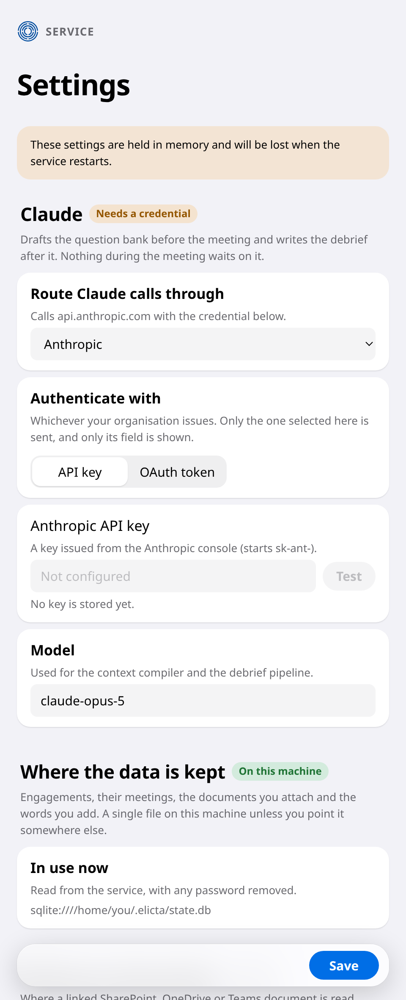
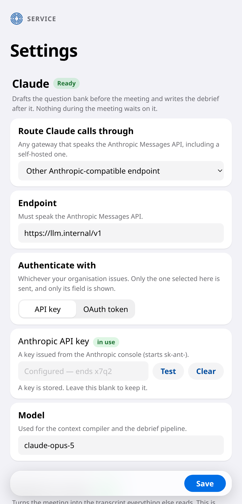
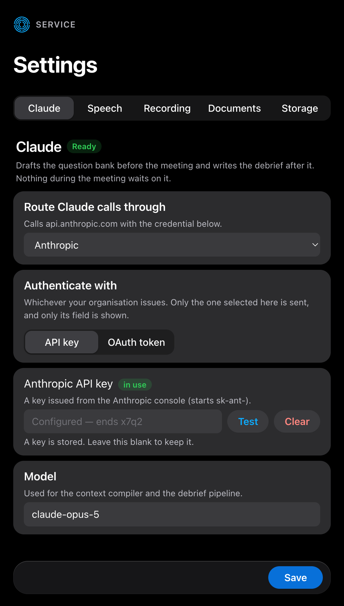
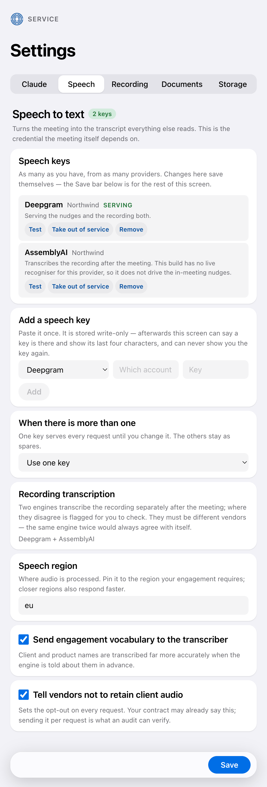

# Setting It Up

Elicta uses outside services for two things: turning speech into text, and doing
the writing-up afterwards. Somebody has to tell it which services to use and give
it permission to use them. It is done in the app, once, by whoever administers
Elicta for the team — not by an engineer editing a server somewhere, because the
person who needs a key changed is rarely the person who could deploy one.

The screen is in three parts, one for each outside service, and each part says
whether it is ready before you read a single field. The credential for a service
sits inside that service's own part, named after the company that issued it, so
there is no list of keys to work out which of them goes where.

## Before anything is set up

On first run the screen says plainly that nothing is configured, rather than
looking ready and failing later. Each part carries its own verdict — one needs a
credential, another needs a key — so what is left to do can be read at a
glance.



## Choosing where the writing-up happens

You can point Elicta at the company that makes the underlying service directly,
at Amazon's, Google's or Microsoft's hosted versions of it, or at your
organisation's own internal gateway. Each choice asks only for what it actually
needs, and refuses to save if something is missing — a message here is better
than a failure halfway through writing up a meeting.

Two of those choices ask for no key at all. If you already run on Amazon or
Google, Elicta uses the permissions your cloud account grants it. Asking you to
paste a key there would mean creating a long-lived credential in a place where
your own platform has a better mechanism — so when you choose one of them, the
credential fields do not appear at all rather than sitting there greyed out.



## Keys and tokens

Both are supported, because organisations issue different things. You say which
kind you have, and only that one is asked for — the screen no longer shows you
two boxes and leaves you to work out which of them matters. If the other kind is
still stored from before, Elicta says so in a line of its own and offers to
remove it, so nothing is left on the service that you cannot see.



Four details on this screen exist to stop a credential leaking, and they are
worth knowing about because they change how the screen behaves:

```diagram
type: stack
title: Why the credential fields behave oddly
item: The field is always empty | Elicta never sends a stored key back to the screen, so there is nothing to show. It displays the last four characters instead, which is enough to tell one key from another.
item: Blank means leave it alone | Saving a different setting cannot wipe your key by accident.
item: Clear is separate and deliberate | Removing a credential is its own action, because it cannot be undone.
item: Test really tests | It checks the credential against the service rather than reporting "configured" as though that meant "working". If it fails you see the service's own explanation, never your key.
```

## Choosing transcription services

The live transcription and the after-the-meeting transcription are set up
separately, because they are bought on different qualities. The live one is
chosen for how quickly it can tell that a sentence has finished. The
after-the-meeting ones are chosen for being accurate — and for disagreeing
usefully with each other.



The key for transcription sits with that choice, under the name of the company
that issued it, because that is the name on the tab you copied it from.

The two used for the recording must be different companies. The same service
twice would agree with itself and flag nothing, so the form will not accept it.
You can also point Elicta at a service it does not ship support for, though it
will tell you that some behaviour then needs checking against that provider
yourself.

## Reading documents from SharePoint or OneDrive

This one is optional, and it is worth knowing exactly what it buys you before
you go asking anybody for it.

Documents reach Elicta two ways: you drop the files onto the preparation screen,
or you paste a link to them. Dropping files needs nothing set up at all. A link
has to be fetched, and fetching from your organisation's SharePoint or OneDrive
means Elicta has to be allowed in — which is a registration your Microsoft
administrator creates, giving you a directory id, an application id and a
secret. Those three go here.

Until they are filled in, pasting a link is refused, with a message saying so.
That is deliberate. A link recorded but never read would sit in the document
list looking like preparation that had happened, and the questions drafted from
it would quietly be drafted from nothing.

## Where your data is kept

Everything an engagement remembers — the client, its meetings, the documents
you attach and what was read out of them, the words you add, and the drafted
questions — is written to a single file on this machine as you work. Nothing
needs installing for that, and nothing leaves the machine to make it happen.

A firm that would rather keep all of it on its own database server can say so
here instead, and Elicta will use that from then on. The connection details
include a password, so they are stored the same way as every other credential
on this screen: entered once, never shown back. What the screen does show is
which server is in use, with the password taken out, so you can confirm at a
glance that a machine is pointed where you think it is.

A change here takes effect the next time the service starts, not the moment you
save it. The screen says so rather than letting you assume otherwise.

## For a shared installation

Where several machines share a deployment, the key can come from your own secret
store rather than being typed in — anything with a command line will do. If the
store cannot be reached, Elicta refuses to start and says why, rather than
quietly generating a new key that would leave the other machines unable to read
anything.

<!-- HANDBOOK-NAV -->

---

← [What Elicta Does](01-what-elicta-does.md) · [Contents](../index.md) · [Getting It Onto People's Machines](03-installing-it.md) →
