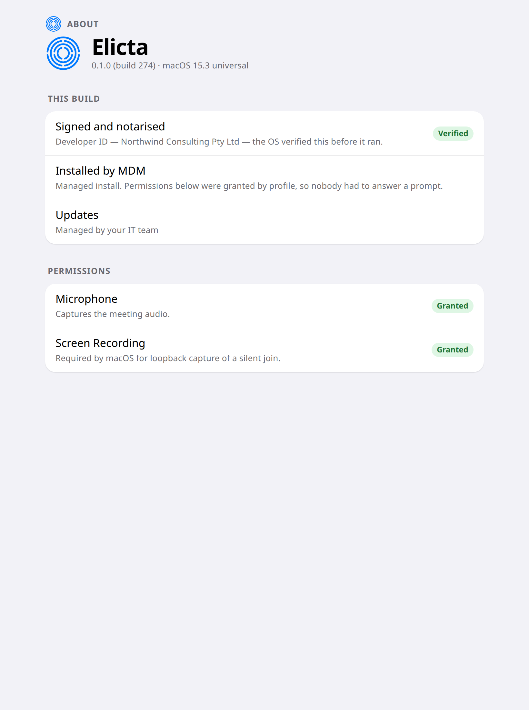
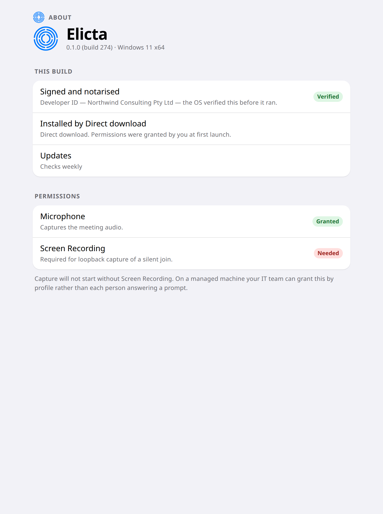

# Getting It Onto People's Machines

This is invisible when it goes well and very visible when it does not. A meeting
tool that asks every person for permission to record their screen generates the
same support ticket over and over.

## The preferred route

Push Elicta out through your device management system. That is the recommended
route rather than the fallback, because it lets you grant microphone and
screen-recording access centrally. Nobody sees a permission prompt, and nobody
has to be talked through one during a client meeting.

Keep the plain installers as a backup for machines outside management.

## Agree the security exception first

An unfamiliar application opening an audio stream is exactly what endpoint
security software is built to flag. It will flag it — and if this is left until
the pilot, it will flag it in the middle of somebody's client meeting.

Get the exception agreed before the pilot rather than during it. This is the
single most common cause of a bad first impression.

## What each person does at first launch

Very little, if the push worked. Otherwise they will be asked once for
microphone access and, on some systems, for screen recording. Both are required
for Elicta to hear the meeting at all.

<!-- HANDBOOK-NAV -->

---

← [Setting It Up](02-setting-it-up.md) · [Contents](../index.md) · [Preparing for an Engagement](10-preparing.md) →
