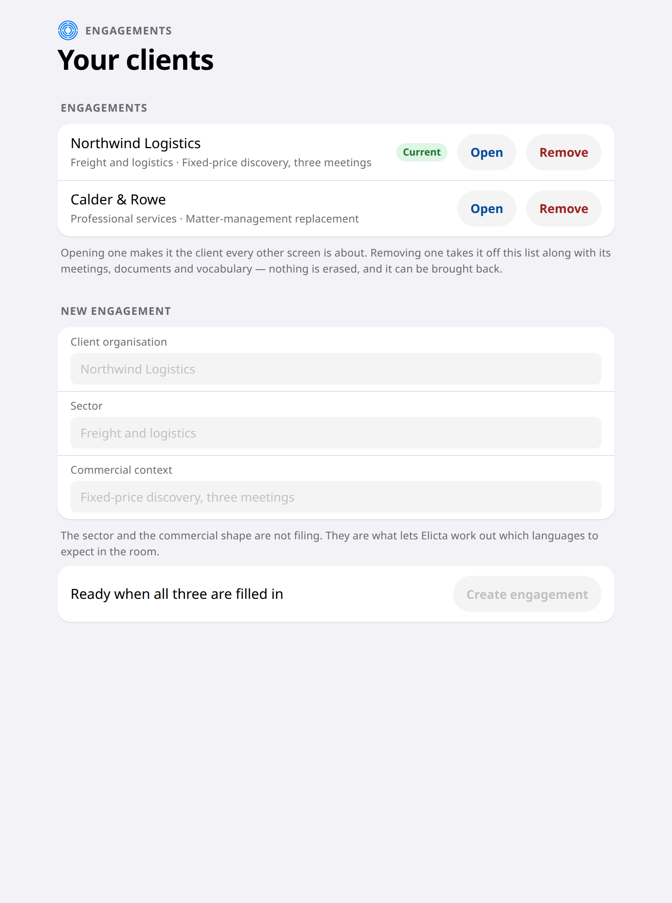
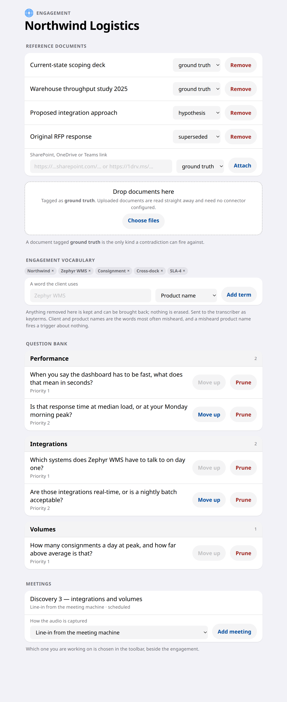

# Preparing for an Engagement

Almost everything that makes Elicta useful happens before anyone sits down. That
is deliberate: the thinking is done in advance so that during the meeting it only
has to pick the right question from work already finished. It is the only way a
suggestion can arrive while it is still worth having.

Do this days before the first meeting, not the morning of it.

## Tell it about the client

Elicta opens on your clients. Each one is an engagement, and adding one asks for
three things: who they are, the sector, and the commercial shape of the work.

That is not filing. It is what lets Elicta work out which languages to expect in
the room, so that nobody has to be asked to choose one before a meeting starts.



Opening a client is what makes it the one every other screen is about, and the
row itself is what opens it — press anywhere along it. The one in force is
tinted rather than labelled, the way a chosen row looks anywhere else on this
machine.

It is also where you remove a client you no longer want on the list, which
takes its meetings, documents and vocabulary out of view with it and erases
nothing. Removing asks first, in a dialog naming the client and saying what
removal actually does — one press taking a whole client off every screen at
once was more than a single button's worth of consequence. Removing a meeting
asks in the same way, and says what it keeps.

The safe answer is the one already selected, so pressing Enter out of habit
keeps rather than removes, and Escape is a way out rather than agreement.

Everything else on this page happens on the Preparation screen, about the one
client you opened.

## Switching between them

Once a client is open, the quickest way to a different one is the control at the
top of the window, beside the name of the screen you are on. It follows you from
screen to screen, so you do not have to come back to the list to change your
mind.

Your choice is remembered, so reopening Elicta puts you back where you left off
rather than on whichever client happens to be oldest. And a screen that looks
empty is far more often pointed at a different client than genuinely empty —
that control is the first place to check.

## Set up the meetings it will have

An engagement is a client. A meeting is one conversation with them, and
everything after this page is about a meeting — consent, the live panel, the
recording, the write-up. So an engagement needs at least one before any of that
applies to it.

Adding one asks a single question: how the audio will reach Elicta. Line-in
from the meeting machine, a silent join that takes the audio as loopback, or a
microphone. You can change that later.

A new meeting arrives without a name, so the list shows it by its number. Give
it one with Rename — "Discovery 2 — depot volumes" reads better than a number,
and by the third meeting under one client it is the difference between a list
you can use and three identical rows. Remove takes a meeting off the list.
Nothing is erased by it: if the meeting happened, its consent record and its
recording stay exactly where they are. It is there for the meeting you added by
mistake.

Which engagement and which meeting you are working on is chosen at the top of
the window, and the choice follows you from screen to screen.

## Add what you already have

Scoping decks, throughput studies, the last proposal. There are two ways in, and
they are equally good:

Drop the files straight onto the preparation screen, or pick them with the
button beside the drop area. Nothing needs setting up first, and Elicta reads
what is inside them — Word, PowerPoint, Excel and PDF alike, not just the
filename on the front.

Or attach a document by its SharePoint, OneDrive or Teams link. Those are the
only kinds of link Elicta accepts, so that what it works from is the copy your
client can also see rather than one that has quietly drifted onto somebody's
laptop. Reading from your Microsoft 365 tenant is the one thing here that has to
be set up first, and if it has not been, attaching a link is refused with a
message saying so — rather than the document sitting in the list looking as
though it counted.

Each document is tagged as one of three things, and the tag changes how Elicta
treats it:

```diagram
type: stack
title: The three document tags
caption: The tag decides whether a contradiction is worth interrupting a meeting for.
item: Ground truth | Established fact. If a client contradicts it, that is worth interrupting for.
item: Hypothesis | Our assumption, not theirs. It produces questions to verify rather than contradictions to flag.
item: Superseded | Kept for background, never used to challenge anyone.
```

## Add the client's own words

Product names, internal systems, their own jargon — the words a transcription
service would have no way of knowing.

This is the single most effective thing you can do for accuracy, and it is worth
more than any other preparation on this page. A misheard product name does not
just look sloppy. It reads to Elicta as something brand new, and it will
interrupt you to ask about a system that does not exist.

## Taking something back out

Every document has a **Remove** beside it, and every word has a small × on its
chip. There is also a way to remove the whole engagement, at the foot of the
page.

None of it erases anything. What you remove stops appearing — the engagement
goes off the list and takes its documents and vocabulary out of view with it —
and the record is kept, so a removal made by mistake is not a catastrophe.

That is worth being plain about in both directions. It means you can tidy
freely. It also means removing a client here is *not* how you would honour a
request to erase their data; that is a different thing, and Elicta does not do
it yet.

The word list is the one where removing matters most. A wrong word handed to
the transcription service is worse than no word at all, because it makes the
transcript confidently wrong rather than merely uncertain — so a typo there is
worth correcting the moment you notice it.

## Review the questions before anybody asks them

Elicta reads everything and drafts the questions worth asking, grouped by the
section of your requirements template that each one serves. You read them, move
the ones that matter up the list, and prune the ones that miss.

A drafted bank runs to seventy-odd questions, so the sections open one at a time
rather than arriving as one very long page, and each says how many questions are
inside it before you open it. There is also a box that filters the whole bank by
what a question says — the way to find the four that mention one system without
reading the other seventy. While that filter is on you can still prune, but not
reorder: moving a question up means moving it past the one above it, and under a
filter the question above on screen is not the one above in the bank.

Pruning is not deletion. A pruned question is kept as a record of your judgement
and left out of the list, so redrafting the bank later does not bring it back for
you to reject a second time.

While you are reading a section, its heading stays at the top of the screen
rather than scrolling away above the questions, so you can always see which part
of the template the ones in front of you belong to.

## Finding your way around a long page

With a full bank open this screen runs to a dozen screenfuls, and the meetings
sit at the very bottom of it. Beside the page — across the top of it, in a
narrow window — is a list of its parts: the documents, the words, the questions
and the meetings, with the sections of the bank named underneath and the number
of questions in each. It marks the part you are reading as you move, and takes
you to any other in a single click. That is the short way to the foot of the
page without crossing the questions to get there, and the short way back.

Clicking a section of the bank opens it as well as going to it, so you never
arrive at a heading with nothing under it.

The keyboard works on this page too. Page Down, End and the arrow keys move it
once you have clicked anywhere on the page, which on a screen this long is worth
knowing.



Under each question is where it came from: the document it was drafted from
and how you tagged that document, or *reasoned from the engagement* where
there was no page behind it and Elicta worked it out from the sector and the
commercial shape instead.

That line is the one to read when you are deciding what to cut. A question
drawn from a document you called ground truth stands on something the client
wrote down. A reasoned one is a guess — often a good guess, and on a thin set
of documents most of the bank will be guesses, which is worth knowing before
you walk in rather than after. It also makes a long bank quicker to review:
you can take out the guesses in one pass and read the rest properly.

This review is worth doing even if you never open Elicta during the meeting. A
good question list makes you better prepared on its own — which is why it comes
first, and why you are meant to edit it rather than trust it.

## If the question bank comes back empty

Three things can cause it, and it is worth knowing which.

The first is setup: drafting the questions needs one of the outside services
configured, which is covered earlier in this guide.

The second is that a draft can only work from documents it has actually read. If
every document you added is a link and your Microsoft 365 tenant is not
registered yet, none of them were read — and you would have seen each link
refused at the time, with a message saying so. Dropping the files in instead
needs nothing configured, and is the quickest way to get a real bank out of a
first engagement.

The third is simply that it is not finished yet. Drafting a bank is slow work,
so it is handed off as a job that takes some minutes; Elicta goes back for the
result on its own and fills the bank when it arrives. Compile before you make
coffee rather than while the client is waiting. While it is working the screen
says so, and will not let you start a second one on top of it.

**The screen tells you which of these it was.** Where a compile ran and stopped,
it names the step that stopped and what to do about it — nothing set up, a
credential that is not allowed to use the model you chose, a service being
throttled, a network it could not cross. Those have different fixes and only one
of them is waiting. It used to say "not compiled yet" however many times a
compile had run and failed, and the explanation went to a log the person reading
the screen was never going to see.

Drafting the questions is normally handed to the cheaper of two ways of asking,
which some accounts are not permitted to use. Where yours is not, Elicta asks the
ordinary way instead rather than giving up — it costs more per compile and
finishes in one go rather than two, which is the better trade when the
alternative is no questions at all.

One kind of document contributes nothing either way: a scanned PDF, where the
page is really a photograph of a page. Elicta does not try to guess at the words
in a picture, so such a document adds nothing rather than adding nonsense. If a
scan is the only copy you have, the vocabulary list is where that document's
important words are best put.

<!-- HANDBOOK-NAV -->

---

← [Getting It Onto People's Machines](03-installing-it.md) · [Contents](../index.md) · [Starting a Meeting](11-starting-a-meeting.md) →
