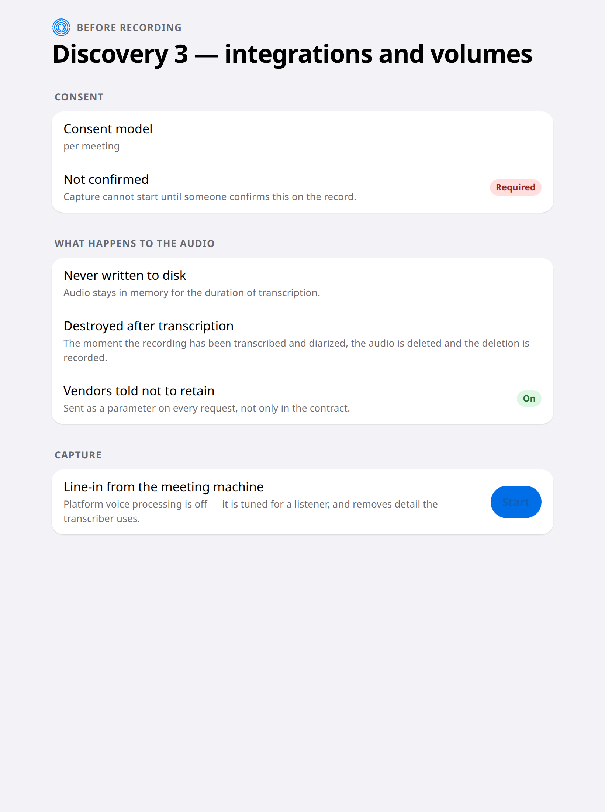
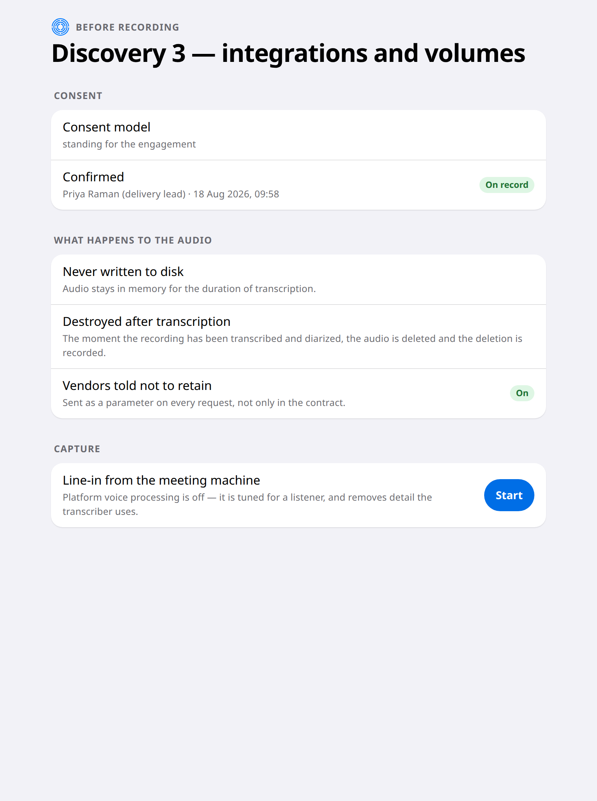

# Starting a Meeting

Recording a client without a clear record of their consent is the kind of mistake
that ends an engagement. So in Elicta it is a gate you pass, not a warning you
read past.

## Consent first

The screen shows how consent works for this client — agreed once for the whole
engagement, or needed for every meeting — and whether it has actually been given.

Until somebody confirms it on the record, recording cannot start. The button is
simply unavailable.



Once confirmed, the screen keeps who confirmed it and when. The answer to "did we
have permission for this?" is never a memory test.



## What happens to the audio, said before it happens

The same screen tells you what Elicta will do with the recording, before a second
of it exists. You can read it aloud to a client who asks.

```diagram
type: steps
title: What happens to the recording
caption: Each of these is something Elicta does, not something it promises.
item: It is never written to disk | The audio lives in memory only, and only while it is being turned into text.
item: It is destroyed as soon as it is used | The moment transcription and speaker identification finish, the recording is deleted — and the deletion is itself recorded, so the destruction can be shown rather than asserted.
item: The transcription service is told not to keep it | Every request carries that instruction. Your contract may already say so; sending it with each request is what makes it something an audit can check.
```

## Joining the meeting

Elicta can take audio from a wired input on the machine, or join the call as a
silent participant that never speaks. The silent join is markedly more accurate,
for a reason covered in the chapter on controlling the recording: people talking
over each other causes more transcription errors than the choice of service does.

<!-- HANDBOOK-NAV -->

---

← [Preparing for an Engagement](10-preparing.md) · [Contents](../index.md) · [The Panel and the Suggestion](20-the-panel.md) →
