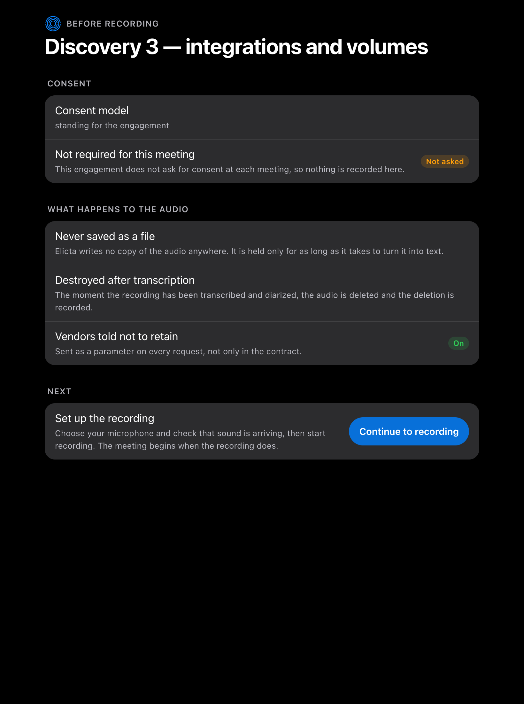

# Starting a Meeting

Recording a client without a clear record of their consent is the kind of mistake
that ends an engagement. Elicta has a gate for exactly that — and in this build,
the gate is set not to ask.

## What this build does

As it ships today, Elicta does not stop to ask for consent before a meeting.
Every engagement is treated as having settled consent once, for the engagement as
a whole, so no meeting puts a question in front of you and recording can start
straight away.

The screen says so in as many words, and it is careful about the difference
between not asking and having an answer: it reports that nothing has been
recorded here, rather than showing you a reassuring tick.



That is a deliberate setting for this stage, not something we overlooked. What it
means in practice is that having the consent conversation, and being able to show
later that you had it, rests with you and not with the software. Elicta will not
stop you, and it will not be holding a record you can point to afterwards.

## When consent is asked at every meeting

The gate itself is built and works. Where an engagement is set to ask at every
meeting, recording cannot start until somebody confirms it on the record. The
button is simply unavailable.


Confirming happens here, on the same screen. Elicta sets out what has to be true
before recording — that everyone in the meeting has been told and has agreed —
together with the law that requirement rests on, and asks for the name of the
person confirming it. That name is not a participant list. It identifies whoever
is accountable for having disclosed the recording, which is what somebody
reviewing this later actually needs to know.

Once confirmed, the screen keeps who confirmed it and when. The answer to "did we
have permission for this?" is never a memory test.


Choosing which way an engagement works is not yet something the screens can do,
so for now every engagement takes the setting described above.

## What happens to the audio, said before it happens

The same screen tells you what Elicta will do with the recording, before a second
of it exists. You can read it aloud to a client who asks.

```diagram
type: steps
title: What happens to the recording
caption: Each of these is something Elicta does, not something it promises.
item: It is never saved as a file | Elicta writes no copy of the audio anywhere. It is held only for as long as it takes to turn it into text.
item: It is destroyed as soon as it is used | The moment transcription and speaker identification finish, the recording is deleted — and the deletion is itself recorded, so the destruction can be shown rather than asserted.
item: The transcription service is told not to keep it | Every request carries that instruction. Your contract may already say so; sending it with each request is what makes it something an audit can check.
```

## Joining the meeting

Elicta can take audio from a wired input on the machine, or join the call as a
silent participant that never speaks. The silent join is markedly more accurate,
for a reason covered in the chapter on controlling the recording: people talking
over each other causes more transcription errors than the choice of service does.

<!-- HANDBOOK-NAV -->

---

← [Preparing for an Engagement](10-preparing.md) · [Contents](../index.md) · [The Panel and the Suggestion](20-the-panel.md) →
