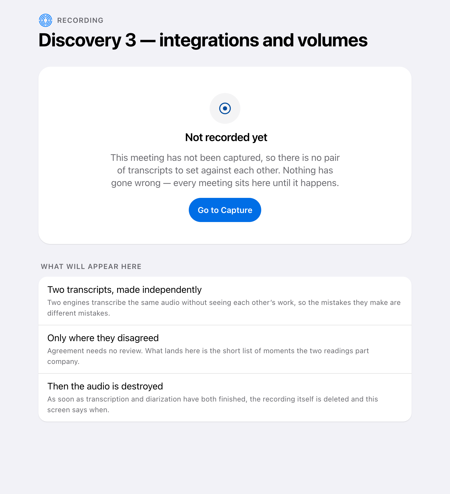

# Checking the Recording

During the meeting, turning speech into text is tuned for speed — a suggestion
that arrives late is worthless. Afterwards it is tuned for being right, because
everything in the write-up comes from this version and not from the live one.

## Two transcriptions, on purpose

The recording is transcribed twice, by two different companies.

Not for redundancy — for disagreement. Where two independent services produce the
same text, it is almost certainly right and needs nobody's attention. Where they
differ, something was genuinely unclear, and that is exactly what a person should
look at.

The two readings sit side by side because you are comparing them. Stacked, it
becomes a memory exercise.

Disagreements are always flagged and never quietly resolved by picking a winner.
The whole value is in surfacing the doubt.

Always means any difference at all, down to a single word — and that is the
case worth being explicit about. A service that hears *fifty* where the client
said *fifteen* agrees with the other one about every other word in the
sentence, so a comparison that scored the sentence as a whole would call that
agreement and say nothing. It is the numbers and the names that decide what
gets built, and they are exactly what two services disagree about, so those
are the ones put in front of you.

## Before there is anything to check

Most of the time you will open this page for a meeting that has not been
recorded yet, and that is the version of it you will see first.

It used to answer that by drawing the full page with the values taken out — two
figures reading "—" and "0", an empty box where the two services would be
named, and nothing to do next. That is the same picture the page would draw
after a comparison that ran and found nothing wrong, and those two situations
could not be further apart: one is work still to come, the other is a result.

It now says which one it is, says plainly that nothing has gone wrong, and
offers the one step that would fill it. What is listed underneath is what the
page will hold once a recording exists — worth saying while there is room to
say it.

## It is still there tomorrow

A checked recording is not something you have to deal with in one sitting.
Closing Elicta and coming back to it later leaves the two transcriptions, the
list of disagreements and the record of the audio being destroyed exactly where
they were.

That is worth stating because it was not always true. Those three were held
only for as long as the program was running, on the reasoning that they could
be worked out again from the recording — which they could not, because the
recording is deleted as soon as the transcribing finishes. Reopening the app
showed a meeting you had certainly recorded as one that had never been
recorded at all.

## Then the audio is destroyed

The moment both transcriptions and the speaker identification have finished —
whether they succeeded or failed — the recording is deleted, and the deletion is
recorded.

Nothing still needs it, and keeping it only widens what could be exposed if
something went wrong later.

## Where this is honest about itself

The comparing, the flagging and the destroying are built, and the transcribing
is now connected: both companies are reached with the credentials you put in
Settings, and the service says at startup which of the two it can actually
speak to.

Configure neither and the honest behaviour is unchanged — the job is accepted,
the two engines are named, and no disagreements are reported, because nothing
was transcribed. A page reporting perfect agreement over nothing is the one
result that would be worth distrusting, so read the setup screen before you
read the figures.

The screen says exactly that rather than putting a figure on it. It used to
report that the engines had agreed on none of the recording, directly beside a
count of nought disagreements — two numbers contradicting each other in the same
row. Neither was a measurement. Where nothing has been compared it now says so,
and that reads differently from two engines that were compared and matched
throughout.

The count beside it took longer to correct than the percentage did. A nought in
that place is a claim about a review that happened and turned nothing up, so
where there is nothing to count no count is offered.

There is also a way to measure how much the pairing catches, once it runs: given
a recording and a known-correct transcript, it reports what share of the mistakes
the two services would have shown you. A sample containing no mistakes reports
"cannot tell" rather than a clean pass, because it is no evidence either way.

That measurement has not been run against real client recordings. The answer can
be produced; it has not been produced.

<!-- HANDBOOK-NAV -->

---

← [When the Connection Drops](23-when-the-connection-drops.md) · [Contents](../index.md) · [Getting the Write-Up](31-the-write-up.md) →
