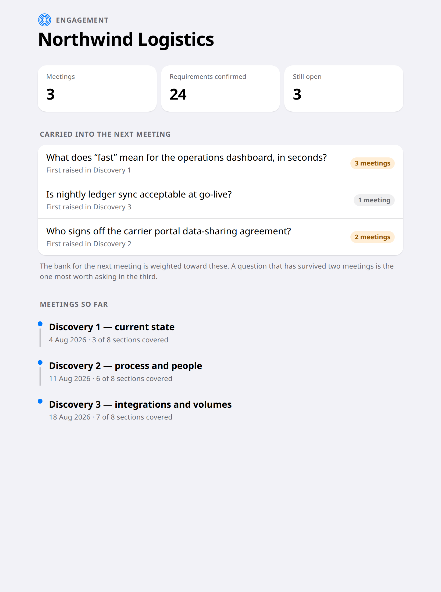

# Carrying It Into the Next Meeting

Requirements are not settled in one sitting. Everything that makes a tool which
follows a whole engagement better than one that forgets after each meeting lives
here.

## What survives

The confirmed requirements, the decisions, and — most usefully — the questions
that are still open.

Open questions lead the screen, ahead of completed work. That ordering is the
point: what you settled is behind you, and what you did not is what you are
walking back in to deal with.

## The question that keeps surviving

A question that has come through three meetings unanswered is flagged.

That is worth knowing before you walk in, because there are only two
explanations and both matter. Either it is genuinely hard, or it is being
deflected. Flagging it puts the choice of how to handle that in front of you
while you can still plan for it.

The intent is that the question list for the next meeting leans towards these,
so you do not start from scratch and are not re-asked what was already settled.
That part is not connected yet — see the end of this chapter.

## What is deliberately not kept

Only those things above are stored. The working notes produced along the way
during a write-up are rebuilt from the recording rather than kept.

That is slower. It is also correct: a stored copy could go stale against the
recording it came from, and a stale copy is worse than none, because nothing
about it looks wrong.

## Where this is honest about itself

Keeping the open questions, the decisions and the confirmed requirements works,
and the screen above reads them.

The head start does not. Open a second meeting in the same engagement today and
its question list starts empty rather than leaning on what is still unanswered:
nothing yet rebuilds a meeting's questions from the engagement's carried state.

So the part you read before walking in — what is still open, and how long it has
been open — is there. The part that would save you the preparation is not.

<!-- HANDBOOK-NAV -->

---

← [Getting the Write-Up](31-the-write-up.md) · [Contents](../index.md) · [Judging Whether the Suggestions Are Any Good](40-judging-the-suggestions.md) →
